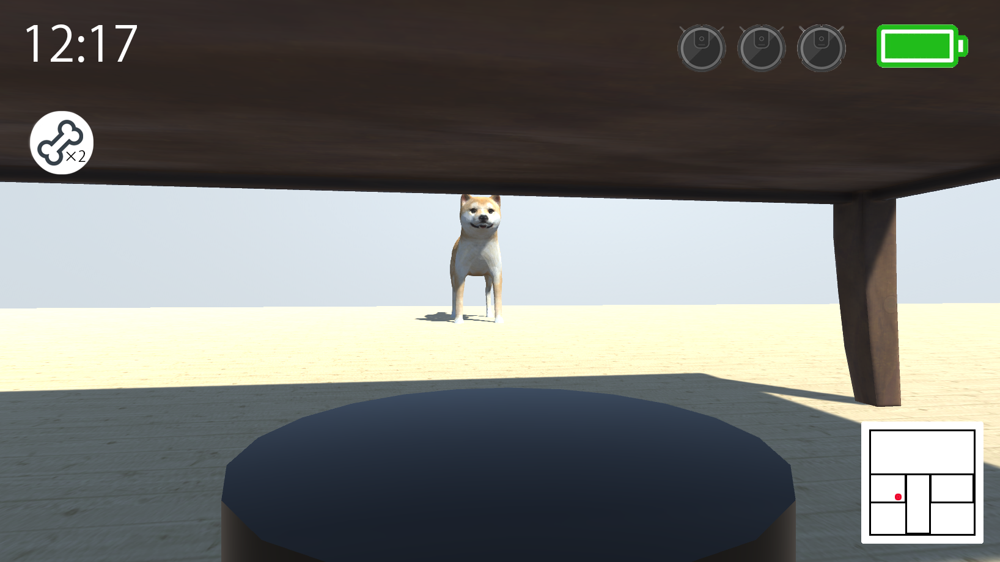
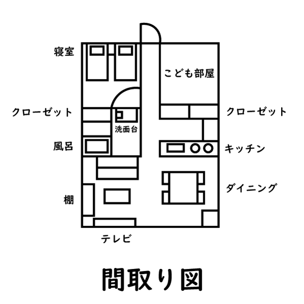
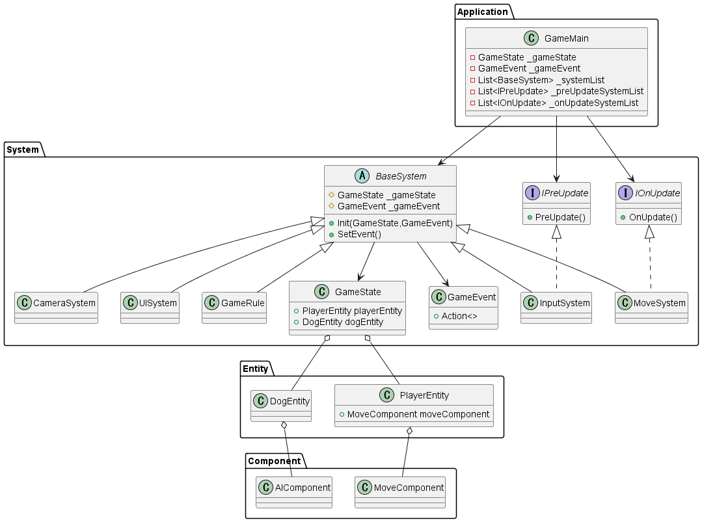

# Operation R 初期構想
[**Operation R**](../works/OperationR.md) の初期構想を公開用にまとめました

# 💡 企画

## どんなゲームか
ロボット掃除機を操作して、部屋を綺麗にしていくゲーム

## 操作方法
- W/S - 前後移動
- A/D - 回転
- 左Shiftキー - 走る
- Spaceキー - 視点変更
- 左クリック - アイテムの使用

## ゲームの性質
1. 犬は各部屋を巡回していて、プレイヤーを見つけたら追いかけてくる
1. プレイヤーは犬の鳴き声から犬の現在地を予測でき、家具の下に隠れたり、犬の気を引くアイテム（おもちゃとか）を使用することで、犬をやり過ごすことができる
1. アイテムはステージに落ちていて、拾ったアイテムはプレイヤーがいる場所に置いて使用できる
1. バッテリーの分だけダッシュすることができ、回復スポットに行くと全回復
1. 犬に捕まると残機が減り、全ての残機がなくなるとゲームオーバー
1. 吸い取ったごみの量がスコアとなる

## 世界観
現代日本。ニンテンドックスみたいな感じ。

## テーマ
犬から逃げながら、床を綺麗にしていくゲーム

## コンセプト
- 自分がロボット掃除機になるという、非日常感
- 自分より大きいものに追われる恐怖
- 部屋がどんどん綺麗になっていく達成感

## システム
1. ロボット掃除機を操作して、犬にみつからないように部屋を掃除する
2. バッテリーがゼロになると走れなくなるという制限の中で、ロボット掃除機の機能を駆使して掃除をしていく
3. アイテムを使用することで、犬から逃げやすくなる
4. 犬が部屋を汚していくため、犬に近づくとより多くのごみを掃除することが出来る

## 設定資料

---

# 📜 設計

## クラス図
