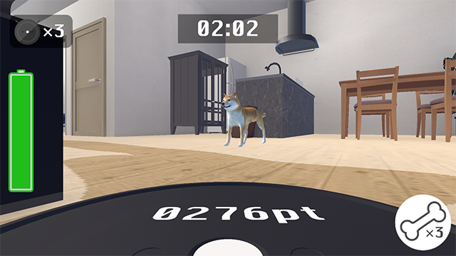
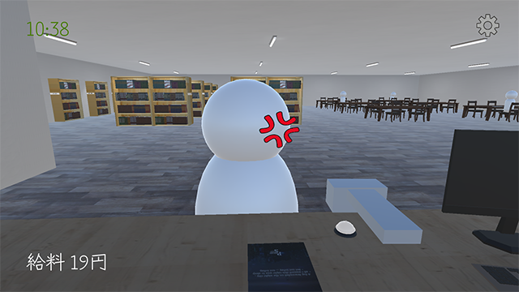
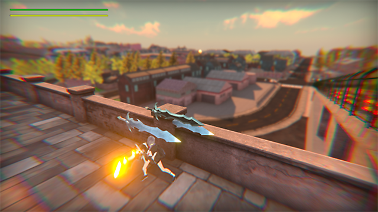
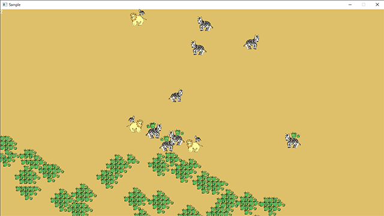
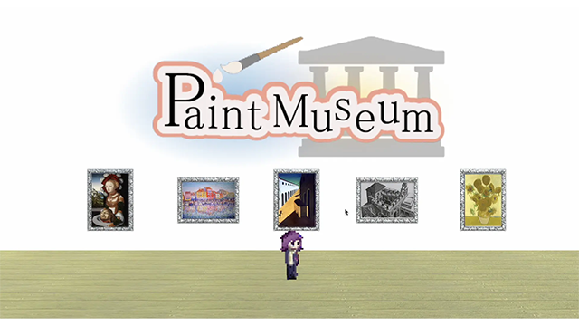
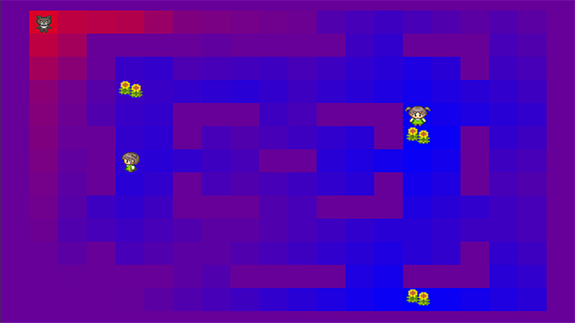
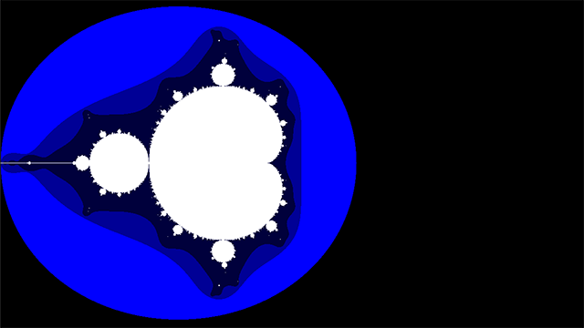
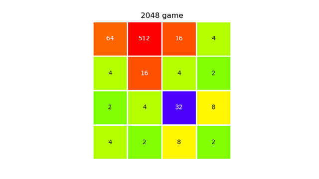

# ホーム
---

### 目次
[[toc]]

---

## リンク
- [GitHub](https://github.com/guinpen98)
- [unityroom](https://unityroom.com/users/wg4v329mc1lrdohjey8i)
- [Speaker Deck](https://speakerdeck.com/guinpen98)
---

## 職歴
||開始時期|終了時期|雇用形態|
|---|---|---|---|
|塾講師|2021年04月|2022年03月|アルバイト|
|Life is Tech! メンター|2022年07月||インターンシップ|

## 経験のある分野

### プログラミング言語
|言語|経験年数|学習時間|技術レベル|
|---|---|---|---|
|C|1年半|100時間以上|リファレンスがあれば使用できる|
|C++|1年|100時間以上|リファレンスがあれば使用できる|
|Unity C#|1年|250時間|リファレンス無しで使用できる|
|Python|1年|20時間|リファレンスがあれば使用できる|
|JavaScript|1年未満|10時間|趣味で触ったことがある|
|SQL|1年未満|10時間|授業で触ったことがある|
|R|1年未満|30時間|授業で触ったことがある|
|GLSL|1年未満|10時間|趣味で触ったことがある|

### 開発ツール
- Visual Studio
- Visual Studio Code
- MySQL
- Anaconda
- RStudio
- Unity

---

## 主な作品

### [🏠 Operation R](https://unityroom.com/games/operation-r) - ロボット掃除機を操作して部屋を掃除するゲーム
詳細ページは [**こちら**](works/OperationR.html)
|ジャンル|制作人数|制作期間|開発環境|
|:---:|:---:|:---:|:---:|
|3Dアクションゲーム|2人|2週間, 60時間|Unity|

---

### [📚 One Librarian](https://unityroom.com/games/one_lib) - 1人で図書館を営業するゲーム
詳細ページは [**こちら**](works/OneLibrarian.html)
|ジャンル|制作人数|制作期間|開発環境|
|:---:|:---:|:---:|:---:|
|3Dアクションゲーム|1人|1ヶ月, 50時間|Unity|

---

### [⚔️ ImagiGate](https://github.com/yshi112358/Stylish-Game-Public) - 討伐目標の敵をフィールド上で探索し倒すゲーム
詳細ページは [**こちら**](works/ImagiGate.html)
|ジャンル|制作人数|制作期間|開発環境|
|:---:|:---:|:---:|:---:|
|探索型アクションゲーム|4人|3ヶ月|Unity|

---

### [🦓 Savannah](https://github.com/guinpen98/Savannah) - 植物、草食動物、肉食動物の生態系シミュレータ
詳細ページは [**こちら**](works/Savannah.html)
|ジャンル|制作人数|制作期間|開発環境|
|:---:|:---:|:---:|:---:|
|生態系シミュレータ|1人|1週間, 20時間|C++|

---

### [🎨 PaintMuseum](https://github.com/guinpen98/PaintMuseum) - 美術館の絵画の中を探索するゲーム
|ジャンル|制作人数|制作期間|開発環境|
|:---:|:---:|:---:|:---:|
|パズルアクションゲーム|6人|30時間|Unity|

---

### [🌻 InfluenceMapping](https://github.com/guinpen98/InfluenceMapping) - AIの知識表現である影響マップを用いたゲーム
|ジャンル|制作人数|制作期間|開発環境|
|:---:|:---:|:---:|:---:|
|未分類|1人|1週間, 15時間|C++|

---

### [🌱 Fractal](https://github.com/guinpen98/Fractal) - マンデルブロ集合、バーンズリーのシダ等の描画
|ジャンル|制作人数|制作期間|開発環境|
|:---:|:---:|:---:|:---:|
|未分類|1人|1週間, 10時間|C++|

---

### [🔢 2048-AI](https://github.com/guinpen98/2048-AI) - 2048を解く強化学習をしたAI
|ジャンル|制作人数|制作期間|開発環境|
|:---:|:---:|:---:|:---:|
|パズルゲーム|1人|1週間, 10時間|Python|

