# ホーム
---

### 目次
[[toc]]

---

## リンク
- [GitHub](https://github.com/guinpen98)
- [Speaker Deck](https://speakerdeck.com/guinpen98)
- [unityroom](https://unityroom.com/users/wg4v329mc1lrdohjey8i)
---

## 職歴
|開始時期|終了時期|雇用形態|
|---|---|---|---|
|塾講師|2021年04月|2022年03月|アルバイト|
|Life is Tech!|2022年07月|2025年03月|就業型インターンシップ|
|Donuts|2023年01月|2025年05月|就業型インターンシップ|
|モルフォAIソリューションズ|2025年04月|2025年07月|就業型インターンシップ|
|dwango|2025年09月|現在|就業型インターンシップ|

## 短期インターン
|会社名|時期|種類|
|---|---|---|
|サイバーエージェント|2023年08月|3days ハッカソン|
|コーエーテクモ|2023年08月|2days インターンシップ|
|プラチナゲームズ|2023年09月|1day インターンシップ|
|アカツキゲームス|2023年09月|就業型 インターンシップ|
|グリー|2023年09月|2days ハッカソン型インターンシップ|
|マーベラス|2023年10月|1day インターンシップ|
|カプコン|2023年10月|2days ハッカソン型インターンシップ|
|サイゲームス|2023年10月|1day ハッカソン型インターンシップ|
|任天堂|2023年12月|1day 仕事紹介 ゲーム開発コース|
|アカツキゲームス|2024年10月|就業型 インターンシップ|
|Speee|2025年7月|3days インターンシップ|
|弁護士ドットコム|2025年8月|5days インターンシップ|
|ソニー・インタラクティブエンタテインメント|2025年8月|5days インターンシップ|
|ディー・エヌ・エー|2025年9月|就業型インターンシップ|

### インターン記事
- [アカツキゲームスで Cocos2d-x / C++コース のインターンシップに参加しました](https://hackerslab.aktsk.jp/2023/10/13/160335)

## 経験のある分野

### コンピュータ言語
|言語|経験年数|使用技術・経験|
|---|---|---|---|
|C#|3年|.NET Framework を使用したサーバーサイドの実務経験や、Unity を用いたゲーム開発経験|
|C++|3年|Siv3D、DX ライブラリ、SFML などの描画ライブラリを用いたソフトウェア開発経験|
|Python|2年|機械学習・深層学習の学習、および機械学習ライブラリを使った開発で使用|
|PHP|1年|Laravel を用いた Web サーバー開発経験|
|Dart|1年未満|Flutter を用いたモバイルアプリ開発経験|

### 開発ツール
|ツール名|経験|
|---|---|
|CMake|さまざまなプラットフォームでアプリケーションをビルドできるように使用|
|Docker|環境依存しない開発環境を構築するために使用|
|MySQL, redis, Nginx|サーバーの運用に使用|
|GitHub Actions|複数のコンパイラでのテストやビルドテストで使用|
|Jenkins|自動ビルド、自動デプロイで使用|

---

## 主な作品

### [💀 PAX SAPIENTICA](https://github.com/AsPJT/PAX_SAPIENTICA) - 歴史シミュレータ
詳細ページは [**こちら**](works/PAXS.html)
|ジャンル|制作人数|制作期間|開発環境|
|:---:|:---:|:---:|:---:|
|歴史シミュレーション|2人|2023年2月〜|C++|
[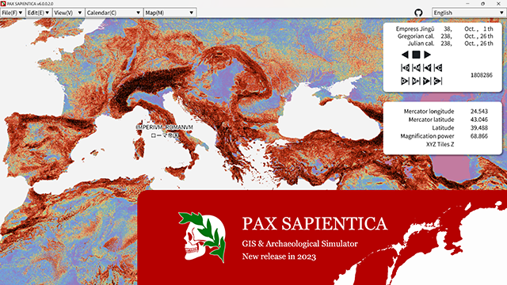](works/PAXS.html)

---

### [🐟 Fish Troop](works/FishTroop.html) - 小型ドローンの群れの攻撃を避けながら敵のコアを破壊するゲーム
詳細ページは [**こちら**](works/FishTroop.html)
|ジャンル|制作人数|制作期間|開発環境|
|:---:|:---:|:---:|:---:|
|3Dシューティングゲーム|5人|2023年4月〜2023年7月|Unity|
[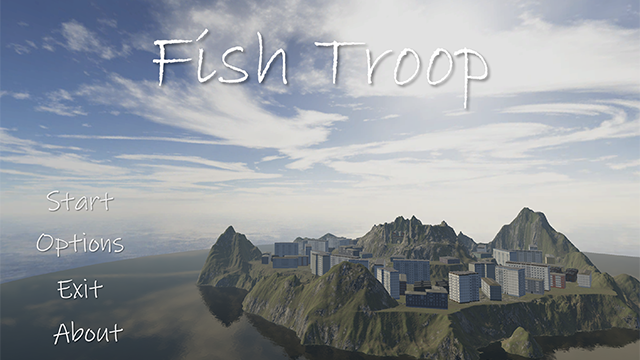](works/FishTroop.html)

---

### [🐲 Replicant Day](works/ReplicantDay.html) - Kinectを使って操作する、裸眼3D立体視のシューティングゲーム
詳細ページは [**こちら**](works/ReplicantDay.html)
|ジャンル|制作人数|制作期間|開発環境|
|:---:|:---:|:---:|:---:|
|3Dシューティングゲーム|4人|2024年4月〜2024年7月|Unity|
[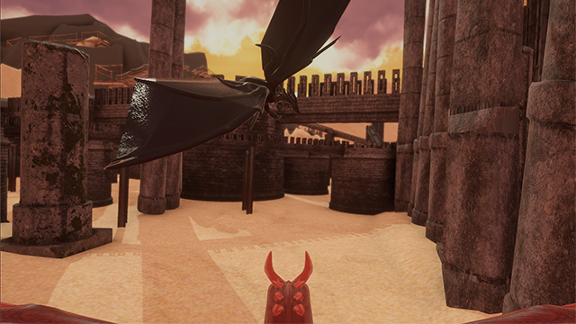](works/ReplicantDay.html)

---

### [🏠 Operation R](https://unityroom.com/games/operation-r) - ロボット掃除機を操作して部屋を掃除するゲーム
詳細ページは [**こちら**](works/OperationR.html)
|ジャンル|制作人数|制作期間|開発環境|
|:---:|:---:|:---:|:---:|
|3Dアクションゲーム|2人|2022年9月〜2022年10月, 60時間|Unity|
[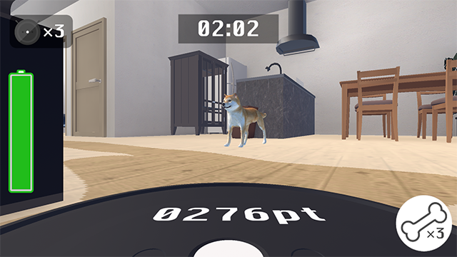](works/OneLibrarian.html)

---

### [⚔️ ImagiGate](https://github.com/yshi112358/Stylish-Game-Public) - 討伐目標の敵をフィールド上で探索し倒すゲーム
詳細ページは [**こちら**](works/ImagiGate.html)
|ジャンル|制作人数|制作期間|開発環境|
|:---:|:---:|:---:|:---:|
|探索型アクションゲーム|4人|2021年7月〜2021年10月|Unity|
[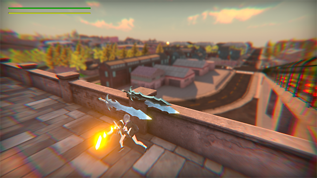](works/ImagiGate.html)

---

### [💞 異世界tapple](https://unityroom.com/games/isekai-tapple) - キャラクター同士の相性を見極めて仕分けるゲーム
詳細ページは [**こちら**](works/IsekaiTapple.html)
|ジャンル|制作人数|制作期間|開発環境|
|:---:|:---:|:---:|:---:|
|2D仕分けゲーム|5人|2023年8月|Unity|
[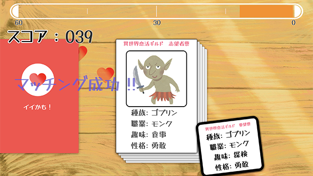](works/IsekaiTapple.html)

---

### [🖊️ iSign](works/ISign.html) - クリエイターの作品を守る画像投稿SNS
詳細ページは [**こちら**](works/ISign.html)
|ジャンル|制作人数|制作期間|開発環境|
|:---:|:---:|:---:|:---:|
|Webアプリケーション|4人|2023年10月〜2023年12月|Nuxt.js, ASP .NET|

---

### [🗣️ HITO](https://github.com/guinpen98/HITO) - キャラクターとお話するゲーム
詳細ページは [**こちら**](works/HITO.html)
|ジャンル|制作人数|制作期間|開発環境|
|:---:|:---:|:---:|:---:|
|対話ゲーム|1人|2022年9月～|C++|
[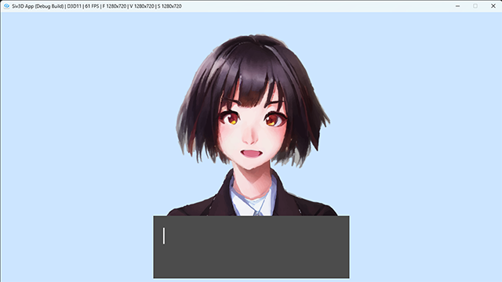](works/HITO.html)

---

### [🔢 2048-AI](https://github.com/guinpen98/2048-AI) - 2048を解く強化学習をしたAI
|ジャンル|制作人数|制作期間|開発環境|
|:---:|:---:|:---:|:---:|
|パズルゲーム|1人|2022年2月|Python|
[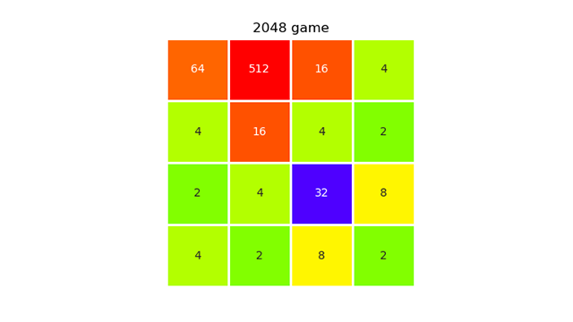](https://github.com/guinpen98/2048-AI)

---

### [📚 One Librarian](https://unityroom.com/games/one_lib) - 1人で図書館を営業するゲーム
詳細ページは [**こちら**](works/OneLibrarian.html)
|ジャンル|制作人数|制作期間|開発環境|
|:---:|:---:|:---:|:---:|
|3Dアクションゲーム|1人|2022年5月〜2022年7月, 50時間|Unity|
[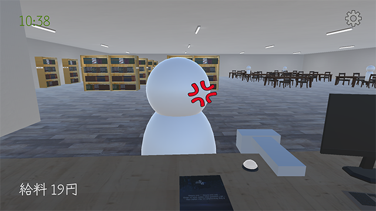](works/OneLibrarian.html)

---

### [🏙️ ImageContents1](https://github.com/HotariTobu/ImageContents1/tree/develop) - 点群データを処理して、VRMLで出力するプログラム
詳細ページは [**こちら**](works/ImageContents1.html)
|ジャンル|制作人数|制作期間|開発環境|
|:---:|:---:|:---:|:---:|
|3DCG|5人|2022年9月〜2023年1月|C++|
[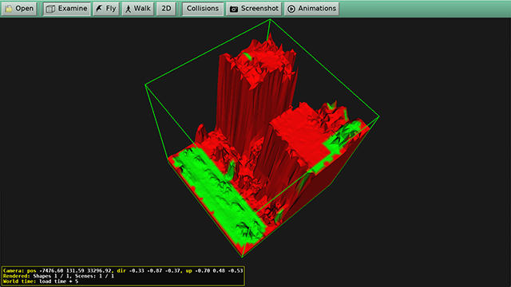](works/ImageContents1.html)

---

### [🦓 Savannah](https://github.com/guinpen98/Savannah) - 植物、草食動物、肉食動物の生態系シミュレータ
詳細ページは [**こちら**](works/Savannah.html)
|ジャンル|制作人数|制作期間|開発環境|
|:---:|:---:|:---:|:---:|
|生態系シミュレータ|1人|2021年12月〜2022年1月|C++|
[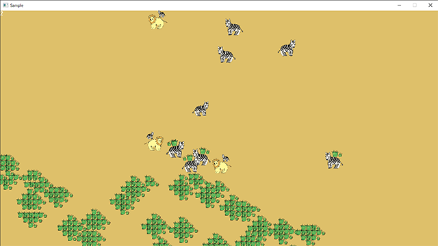](works/Savannah.html)

---

### [🎶 Rhythm DJ](https://unityroom.com/games/rhythm-dj) - リズムに合わせてビートを刻み、フロアを沸かすゲーム
|ジャンル|制作人数|制作期間|開発環境|
|:---:|:---:|:---:|:---:|
|リズムゲーム|5人|2日間|Unity|
[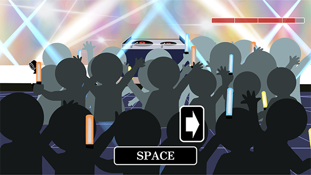](https://unityroom.com/games/rhythm-dj)

---

### [🎨 PaintMuseum](https://github.com/guinpen98/PaintMuseum) - 美術館の絵画の中を探索するゲーム
|ジャンル|制作人数|制作期間|開発環境|
|:---:|:---:|:---:|:---:|
|パズルアクションゲーム|6人|2022年9月|Unity|
[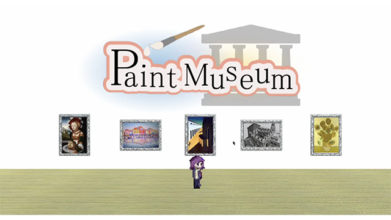](https://github.com/guinpen98/PaintMuseum)

---

### [🌻 InfluenceMapping](https://github.com/guinpen98/InfluenceMapping) - AIの知識表現である影響マップを用いたゲーム
|ジャンル|制作人数|制作期間|開発環境|
|:---:|:---:|:---:|:---:|
|未分類|1人|2022年2月|C++|
[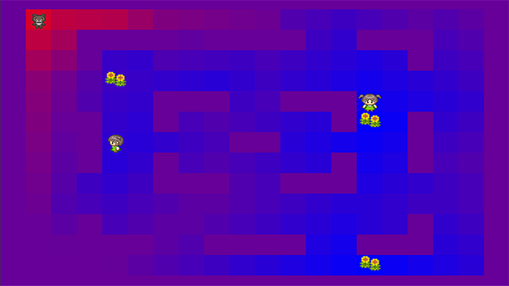](https://github.com/guinpen98/InfluenceMapping)

---

### [🌱 Fractal](https://github.com/guinpen98/Fractal) - マンデルブロ集合、バーンズリーのシダ等の描画
|ジャンル|制作人数|制作期間|開発環境|
|:---:|:---:|:---:|:---:|
|未分類|1人|2022年2月|C++|
[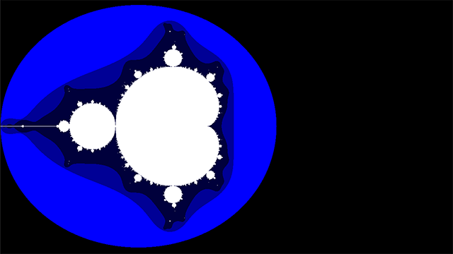](https://github.com/guinpen98/Fractal)
