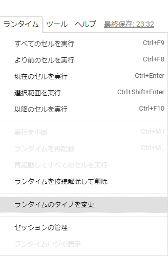
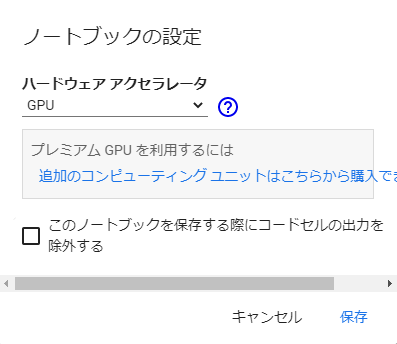

# rinna 社が構築した GPT-2 モデルを使ってみる
### 目次
[[toc]]

## はじめに
2022年 11月 30日に OpenAI が公開した ChatGPT が、公開 6 日目に 100 万ユーザを突破するなど、絶大的な人気を誇っています。そんな ChatGPT の性能の高さから、大規模言語モデルに興味を持って色々調べたところ、rinnna 社が構築した GPT-2 モデルが導入がし易そうだったので、使ってみることにしました。

## GPT-2 について
2019年 2月に OpenAI が発表した自然言語処理モデルです。

元論文 : https://paperswithcode.com/paper/language-models-are-unsupervised-multitask

言語モデルとは、会話や文章などの尤もらしさを確率としてモデル化したもので、GPT-2 は単語レベルの確率の組み合わせから文の確率を計算する言語モデル（自己回帰言語モデル）です。

GPT-2 は Transformer という RNN や CNN を用いない深層学習モデルをベースとしていて、事前学習やファインチューニングを行うことで高い精度の文書を生成できます。
他に Transformer をベースとしているモデルだと、2018年 10月に登場した BERT が有名です。 
BERT は Encoder を複数重ねていおり、文章の分類や単語の穴埋めなどが得意であるのに対し、GPT-2 は Decoder を重ねていて、文章の生成が得意です。

## rinnna 社のモデル
rinna社が構築した GPT-2 大規模言語モデルは以下の通りです。
|language model|layers|params|emb dim|epochs|dev ppl|training time|
|---|---:|---:|---:|---:|---:|:---:|
|japanese-gpt-1b|1.3B|24|2048|10+|13.9|n/a|
|japanese-gpt2-medium|336M|24|1024|4|18|45 days|
|japanese-gpt2-small|110M|12|768|3|21|15 days|
|japanese-gpt2-xsmall|37M|6|512|3|28|4 days|
https://github.com/rinnakk/japanese-pretrained-models より引用

今回は処理時間の関係上、文生成に japanese-gpt-1b を使ってみます。

トレーニングコードは、[GitHub](https://github.com/rinnakk/japanese-gpt2) と NLPモデルライブラリ [HuggingFace](https://huggingface.co/rinna) で、オープンソースとして公開されています。


## 開発環境
今回は GPT-2 の試用が目的だったため、環境構築を必要としない Google Colaboratory を使いました。

環境構築をする機会があったら、追記しようと思います。

## GPT-2 を使って文章を生成
GPT-2を使って文章を生成していきます。
前述したとおり、文章生成には [japanese-gpt-1b](https://huggingface.co/rinna/japanese-gpt-1b) を使っていきます。

### ライブラリのインストール
GPT-2 が含まれるライブラリ transformers をインストールします。
また、transformers.T5Tokenizer をテキストをトークンに分割する際に試用するのでライブラリ sentencepiece も一緒にインストールします。

```bash
!pip install transformers
!pip install sentencepiece
```

### GPT-2 の設定
テキストをトークンに分割するために T5Tokenizer を、訓練済みモデルの読み込みのために AutoModelForCausalLM を設定します。
japanese-gpt-1b を読み込みます。

```py
from transformers import T5Tokenizer, AutoModelForCausalLM

tokenizer = T5Tokenizer.from_pretrained("rinna/japanese-gpt-1b")
model = AutoModelForCausalLM.from_pretrained("rinna/japanese-gpt-1b")
```
### 文の生成
最初の文章をトークナイザーを使って、モデルへの入力に変換します。
文書は『雪国』（川端康成著）の書き出しにしました。
```py
text = "国境の長いトンネルを抜けると雪国であった。"
input = tokenizer.encode(text, return_tensors="pt", add_special_tokens=False)
```
変換した入力を訓練済みのモデルに渡し、モデルの出力を受け取ります。
各設定は、テストコードの値をそのまま使っています。
```py
output = model.generate(input,
                        min_length=50,
                        max_length=100,
                        do_sample=True,
                        top_k=500,
                        top_p=0.95,
                        num_return_sequences=3,
                        pad_token_id=tokenizer.pad_token_id,
                        bos_token_id=tokenizer.bos_token_id,
                        eos_token_id=tokenizer.eos_token_id
                       )
```
受け取った出力をトークナイザーを使って文章に変換し、表示します。
```py
generated_sentence = tokenizer.batch_decode(output, skip_special_tokens=True)
for sentence in generated_sentences:
    print(sentence)
```
結果は以下の通りです。
```
国境の長いトンネルを抜けると雪国であった。白かった。白銀の世界。銀世界が美しい。白い空と、白い雪。真っ白な世界。その中に、雪が降る。白く、静かに降る、銀の雨。白銀の光と、白い雪。
国境の長いトンネルを抜けると雪国であった。夜の東北道は予想通りかなりの渋滞。
国境の長いトンネルを抜けると雪国であった。夜の十一時である。トンネルを抜けると雪国であった。夜なので、雪は積もっていないが、車の中は極度に寒くなって目を覚ました。雪国なので、車の往来も少なく、前方の闇の中に列車のライトがぼんやりと差し込むのみである。外は深い雪におおわれている。車内は極度に寒くなり、毛布に包まって横になる。列車の走行音が、耳の中に響く。車内の温度も氷
```
かなり自然に文章が生成されていますね。
「num_return_sequences」を 3 に設定しているので、文章が 3 個生成されました。

### GPU 対応
#### コード
GPU で処理を行いたい場合はコードを以下の通りに書きかえます。
```python
import torch
from transformers import T5Tokenizer, AutoModelForCausalLM

tokenizer = T5Tokenizer.from_pretrained("rinna/japanese-gpt-1b")
model = AutoModelForCausalLM.from_pretrained("rinna/japanese-gpt-1b")

if torch.cuda.is_available():
    model = model.to("cuda")

text = "国境の長いトンネルを抜けると雪国であった。"
input = tokenizer.encode(text, return_tensors="pt", add_special_tokens=False)

with torch.no_grad():
    output = model.generate(input.to(model.device),
                            min_length=50,
                            max_length=100,
                            do_sample=True,
                            top_k=500,
                            top_p=0.95,
                            num_return_sequences=3,
                            pad_token_id=tokenizer.pad_token_id,
                            bos_token_id=tokenizer.bos_token_id,
                            eos_token_id=tokenizer.eos_token_id
                        )

generated_sentences = tokenizer.batch_decode(output, skip_special_tokens=True)
for sentence in generated_sentences:
    print(sentence)
```
一番初めに PyTorch をインポートします。
#### Google Colaboratory の設定
Google Colaboratoryで GPU を使用する場合は「ラインタイム」→「ランタイムのタイプを変更」→ハードウェア アクセラレータを「GPU」にします。




## おわりに
今回は rinnna 社が構築した GPT-2 モデルを使って文生成を行いました。時間に余裕ができたら、ファインチューニングも行い、追記しようと思います。