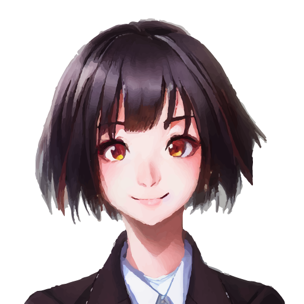
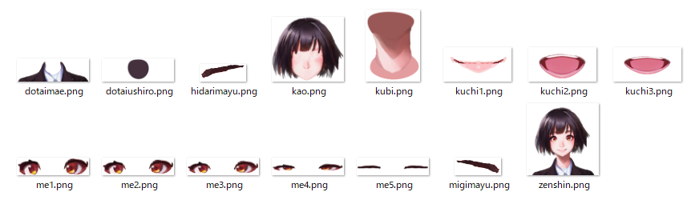

# キャラクターの描画（1回目）
HITO の GitHub は[**こちら**](https://github.com/guinpen98/HITO)

## はじめに
2022年 9月下旬から対話ゲーム [HITO](https://github.com/guinpen98/HITO) の開発をしています。

備忘録として、このゲームの開発日記を不定期で書いていこうと思います。

予定では、キャラクター描画編、対話ゲーム研究編、対話システムの勉強編に分けて書いていこうと考えています。
もしかしたら、もっと分割して書くかもしれません。

## 🎮対話ゲームとは
キャラクターと対話を行う方法は様々なので、対話ゲームには色々な種類があります。この日記では「どこでもいっしょ」「シーマン」「ピカチュウげんきでちゅう」などの、ゲーム内のキャラクターと会話をして、物語を進めていくゲームのことを指すことにします。
1990年代に、音声認識の技術の向上によってカーナビやテレビゲームといった身近な製品に音声認識が使われるようになった影響なのか、これらのゲームはだいだい 1999年あたりに発売されています。
筆者にとって全く縁の無い時代に発売されたゲームたちですが、筆者はゲームのプレイ動画をよく見るので、ゲームの内容はある程度理解しています。

## 🖌キャラクターを描画する

早速、対話システムを作っていきたいところなのですが、対話システムや自然言語処理については学ぶには時間がかかるため、とりあえずキャラクターの描画から実装していきます。まずは形からということです。

### キャラクターの画像を用意する

筆者は絵が上手くないため、今流行りの画像生成 AI に描いてもらいました。

とても上手ですね。最近の画像生成の進化は早すぎて、新しいものが出てくるたびに驚かされます。
この画像は、デザイナーさんにキャラクターを用意してもらう前の、一時的なものとして使用していきます。

これを下記のパーツごとに分解します。

- 胴体前
- 胴体後ろ
- 首
- 顔
- 口（差分3枚）
- 目（差分4枚）
- 右眉
- 左眉

こんな感じになりました。

### Siv3D を用いてキャラクターを描画する

C++ の描画ライブラリである Siv3D を用いて、用意した画像を描画していきます。

単に描画するだけだと、もとの画像から代り映えしないので、目パチ、口パク、顔の回転を周期的に行わせてみます。

こんな感じになりました。少し動きをつけるだけでも印象がかなり変わると思います。

とりあえずキャラクターの描画を行うことができたため、今回はここまでです。
新しい機能の実装をしたらまた記事にすると思います。