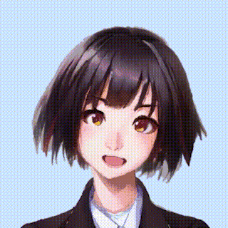

# キャラクターの描画（1回目）
HITO の GitHub は[**こちら**](https://github.com/guinpen98/HITO)

## はじめに
2022年9月下旬から対話ゲーム [HITO](https://github.com/guinpen98/HITO) の開発をしています。

備忘録として、このゲームの開発日記を不定期で書いていこうと思います。

## 🎮対話ゲームとは

「どこでもいっしょ」「シーマン」「ピカチュウげんきでちゅう」などの、ゲーム内のキャラクターと会話をして、物語を進めていくゲームのことを指します。
1990年代に、音声認識の技術の向上によってカーナビやテレビゲームといった身近な製品に音声認識が使われるようになった影響なのか、これらのゲームはだいだい1999年あたりに発売されています。

## 🖌キャラクターを描画する

早速、対話システムを作っていきたいところなのですが、対話システムや自然言語処理についてはまだまだ勉強中なため、キャラクターの描画から実装していきます。

### キャラクターの画像を用意する

筆者は絵が上手くないため、今流行りの画像生成 AI に描いてもらいました。

この画像は、デザイナーさんにキャラクターを用意してもらう前の、一時的なものです。

これを下記のパーツごとに分解します。

- 胴体前
- 胴体後ろ
- 首
- 顔
- 口（差分3枚）
- 目（差分4枚）
- 右眉
- 左眉

こんな感じになりました。

### Siv3D を用いてキャラクターを描画する

C++ の描画ライブラリである Siv3D を用いて、用意した画像を描画していきます。

とりあえず、目パチ、口パク、顔の回転を周期的に行わせてみます。

こんな感じになりました。

少し動きをつけるだけでも印象がかなり変わると思います。