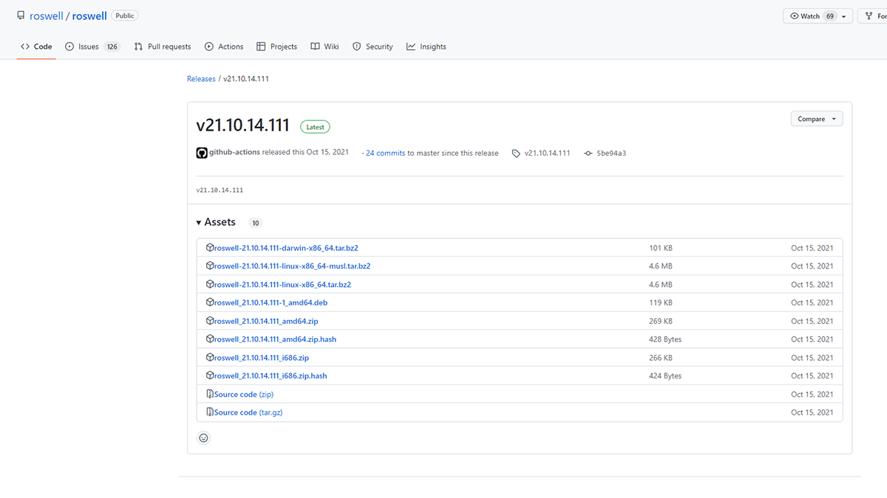

# Common Lisp を触る
### 目次
[[toc]]

## はじめに
この記事は Common Lisp で勉強した内容の備忘録です。
大学の言語系の人工知能の講義の資料にあったコードが Lisp で書かれていて、それをきっかけに Lisp に興味を持ち、勉強してみることにしました。
Lisp には方言と呼ばれる、処理系が複数存在して、その中でも現在で広く使われている方言である Common Lisp を触っていきます。
この記事を書くにあたって、主に Land of Lisp を読んで勉強しました。
環境は Windows です。

## 環境構築
### Roswell をインストール
Land of Lisp では CLISP をインストールしているのですが、筆者は Roswell から処理系をインストールしました。
<br>
CLISP インストーラのダウンロードは[こちら](https://clisp.sourceforge.io/)

Roswell は Common Lisp 環境のセットアップユーティリティです。
Lisp 処理系やライブラリのインストールのほかに、プログラムをコンパイルし、バイナルファイルにパッケージングすることもできるようです。

[Installation - roswell wiki](https://github.com/roswell/roswell/wiki/Installation#windows) にインストール方法が載っています。



最新のリリースノートから、自分の環境にあったものをダウンロードし、Pathを通しました。

### セットアップ
以下のコマンドを叩いてセットアップします。
```
ros setup
```
他の `ros` コマンドを叩いても、処理系が不足している場合は、セットアップを行ってくれるようです。

Roswell のセットアップでは Steel Bank Common Lisp（SBCL）がインストールされます。

---

## Lisp を起動する
コマンドで `ros run` を打つと、デフォルトの処理系が起動します。
```
ros run
*
```
SBCL では「*」がプロンプトとなります。
起動すると自動的に read-eval-print ループ（REPL）に入ります。

>REPL (Read-Eval-Print Loop) とは、入力・評価・出力のループのこと。インタプリタにおいて、ユーザーとインタプリタが対話的にコード片を実行できるもの。

と Wikipedia に書いてありました。
REPL のことをインタプリタだと勘違いしていたのですが、インタプリタが一連のループを行うことを指すようです。

ここでは、Lisp コードを直にタイプすることができます。
試しに足し算を行ってみます。
```lisp
ros run
* (+ 1 2)
3
*
```
Lisp は 1+2 を (+ 1 2)のように関数を前に書く**前置記法** （prefix notation）です。
私たちが使い慣れている、1+2 のような、引数と引数の間に演算子を置く記法は、**中置記法**（infix notation）です。

終了するには以下のようにタイプします。
```
* (quit)
```

## Roswell からスクリプトを実行する
main 関数を作ると、Roswell からスクリプトを実行することができます。

Hello world! を表示するスクリプト「hello.lisp」を書きます。
```lisp
(defun main ()
  (write-line "Hello world!"))
```
これを実行します。
```
ros hello.lisp
Hello world!
```
Hello world! が表示されました。

---

## データ構造
### アトム
シンボルや数値、文字列などリストではないデータのことです。
### シンボル
シンボルは、Lisp の最も基本的なデータ型です。

Common Lisp のシンボルは大文字小文字を区別しません。
シンボル同士の比較は eq で行います。
```lisp
* (eq 'AAA 'aaA)
T
```
### 数値
下記などの型があります。
- 整数
- 分数
- 少数
- 複素数

整数どうしの除算では、少数ではなく分数で返ってきます。
```lisp
* (/ 2 3)
2/3
```
```lisp
* (/ 2.0 3)
0.6666667
```
### 文字列
ダブルクオートでかこみます。文字列の表示には、princ を使います。
```lisp
* (princ "Hello!")
Hello!
"Hello!"
```
### リスト
データを要素とする列型のデータのことで、`(A B C)` のように括弧で要素を囲みます。
```lisp
* (list 'a 'b 'c)
(A B C)
```
list 関数でリストを定義することができます。
```lisp
* (car (list 'a 'b 'c))
A
* (cdr (list 'a 'b 'c))
(B C)
```
car 関数を使うとリストの最初の要素を取り出すことができ、cdr 関数を使うとリストの残りの部分を取り出すことができます。

## モード
Coomon Lisp にはコードモードとデータモードという 2 つのモードがあります。
### コードモード
Lisp はデフォルトではコードモードになっています。

コードはフォームと呼ばれる構造のリストである必要があります。
フォームとは先頭の要素がコマンド（多くの場合は関数名）であるリストのことです。
フォームを読む際には、コマンドの後ろの要素は関数の引数として扱われます。

```lisp
* (expt 2 10)
1024
```
上の例では 2 の 10 乗を計算しています。リストの最初の要素である、expt を読み取った際に累乗を計算するコマンドだと認識しています。残りの要素は関数の引数として渡されます。

### データモード
コードモードとは違い、データモードではコードはデータとして扱われ、コンピュータは実行しようとしません。
```lisp
* '(expt 2 10)
(EXPT 2 10)
```
リストの前に '（シングルクオート）をつけることでデータモードになり、リストをデータとして扱います。この操作のことを「クオートする」とよびます。

## 関数定義と比較関数、四則演算など
### 関数定義 defun
```lisp
* (defun print-hello () (print 'Hello))
PRINT-HELLO
* (print-hello)

HELLO
HELLO
```
### 四則演算
```lisp
* (+ (- 2 1) (/ 4.0 2) (* 2 4))
11.0
```

### 絶対値関数 abs
```lisp
* (abs -3)
3
```

### 比較関数
```lisp
* (<= 8 3)
NIL
```

## 参考
- [Land of Lisp](https://www.oreilly.co.jp/books/9784873115870/)
- [いまから始めるCommon Lisp](https://qiita.com/t-sin/items/054c2ff315ec3b9d3bdc)


