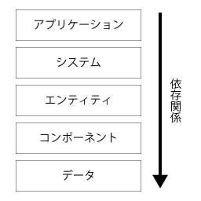
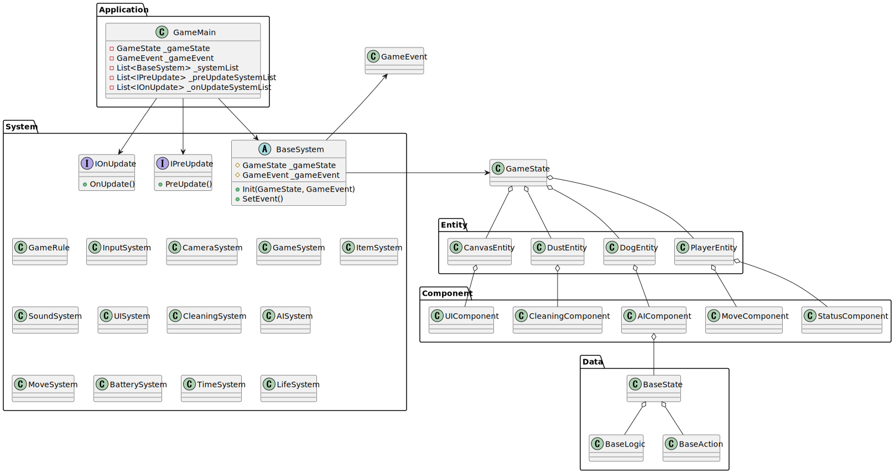

# Unityでのゲーム開発でECSの思想を取り入れた話
**Operation R** の情報ページは [**こちら**](../works/OperationR.md) 

## はじめに
[One Librarian](../works/OneLibrarian.md) の開発では、コードを書き進めていくにつれて、クラスの依存関係が複雑になってしまいました。
その反省を活かして、[Operation R](../works/OperationR.md) を開発をする際に設計をしてみました。

## オブジェクト指向はゲームに向かない？
筆者はゲーム作りを通して、オブジェクト指向を学んでいたのですが、オブジェクト指向での設計ではどうも上手くいかないことがありました。

そこで下記の記事を見つけました。

[オブジェクト指向でゲームを作るのをやめよう](https://qiita.com/tshinsay/items/739ad875cc3925d51f12)

この記事では、ゲームプログラミングにおいて、継承の代わりにコンポジションを扱うことの有用性について話しています。
その際にECSについて少しだけ触れられており、もっと深掘りすることにしました。

筆者はコンポジションのことをよく知らなかったのですが、広義の意味の委譲として考えられるようです。

[【Unity】ゲームにおける委譲と継承、その違いと使い分け【タワーディフェンス】](https://zenn.dev/supple/articles/884d2439cd034a)


## ECSとは
ECSとはEntity component systemの略で、エンティティ、コンポーネント、システムの３つからなるアーキテクチャパターン（設計の考え方のようなもの）です。
データ指向型の設計で用いられることが多いようです。

[Entity Component Systemについてまとめてみる](https://mikan-daisuki.hatenablog.com/entry/2015/10/22/220439)

詳しくは上記の記事をご参考ください。

## 📜 設計をする
### レイヤーを分ける
エンティティ層、コンポーネント層、システム層のほかにアプリケーション層、データ層の5層のレイヤーに分けました。



依存方向は上から下に一方向になっています。

アプリケーション層とエンティティ層に MonoBehaviour を継承させます。

### システム間通信
[エンティティ・コンポーネント・システム - Wikipedia](https://ja.wikipedia.org/wiki/%E3%82%A8%E3%83%B3%E3%83%86%E3%82%A3%E3%83%86%E3%82%A3%E3%83%BB%E3%82%B3%E3%83%B3%E3%83%9D%E3%83%BC%E3%83%8D%E3%83%B3%E3%83%88%E3%83%BB%E3%82%B7%E3%82%B9%E3%83%86%E3%83%A0)

Wikipediaにはシステム間でのデータの送信方法としてObserverパターンが紹介されていますが、今回は[出版-購読型モデル](https://ja.wikipedia.org/wiki/%E5%87%BA%E7%89%88-%E8%B3%BC%E8%AA%AD%E5%9E%8B%E3%83%A2%E3%83%87%E3%83%AB)を採用しました。これを採用することにより、出版側と講読側の関係が疎になり、相手の状態に左右されずに正常に動作し続けることが可能になります。

```cs
using System;
public class GameEvent
{
    public Action<int> Attack;
    public Action<int> Damage;
}
```
```cs
public class GameRule
{
    GameEvent _gameEvent;
    public void SetEvent()
    {
        _gameEvent.Attack += Damage;

    void Damage()
    {
        _gameEvent.Damage?.Invoke();
    }
}
```
GameRuleの中身を書きかえるだけで、簡単にシステム間のやりとりを組み替えることができます。

### システム、エンティティ間通信
システム間通信ではデータの送信方法として出版-講読型モデルを採用しましたが、こちらではObserverパターンを採用します。

## 🖋️ PlantUMLを用いてクラス図を書く
[Visual Studio Code で UML を描こう！](https://qiita.com/couzie/items/9dedb834c5aff09ea7b2)

上記の記事を参考にして、クラス図を作成します。



β版時点でのクラス図はこんな感じです。
PlantUMLで綺麗にクラス図を書くのは、なかなか難しいですね．．．

---

## 関連記事
[Operation R作品詳細](../works/OperationR.md)