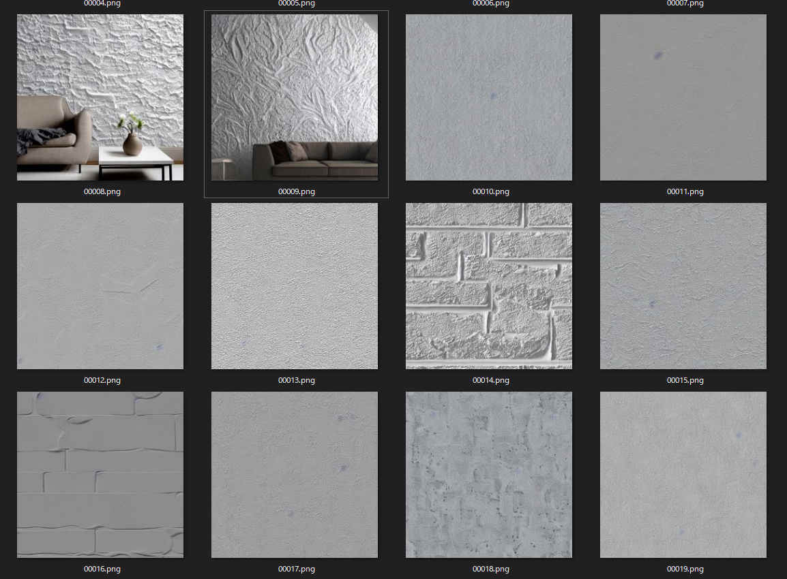
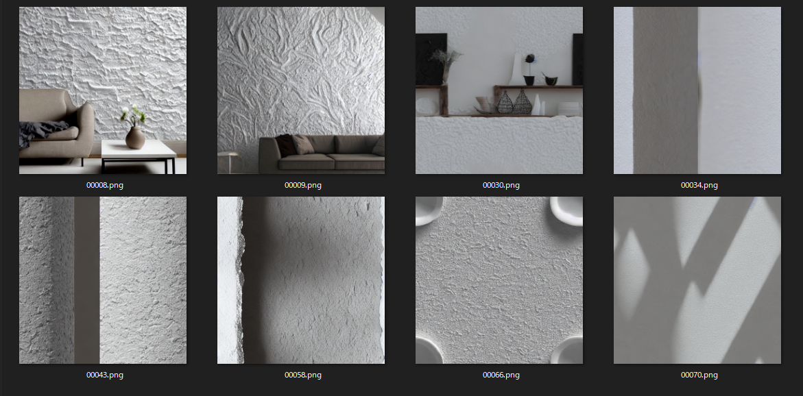
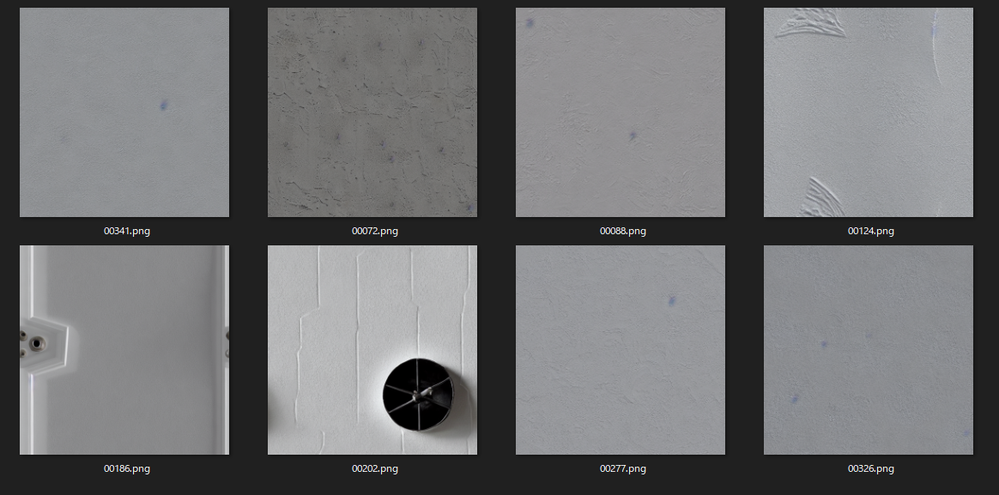
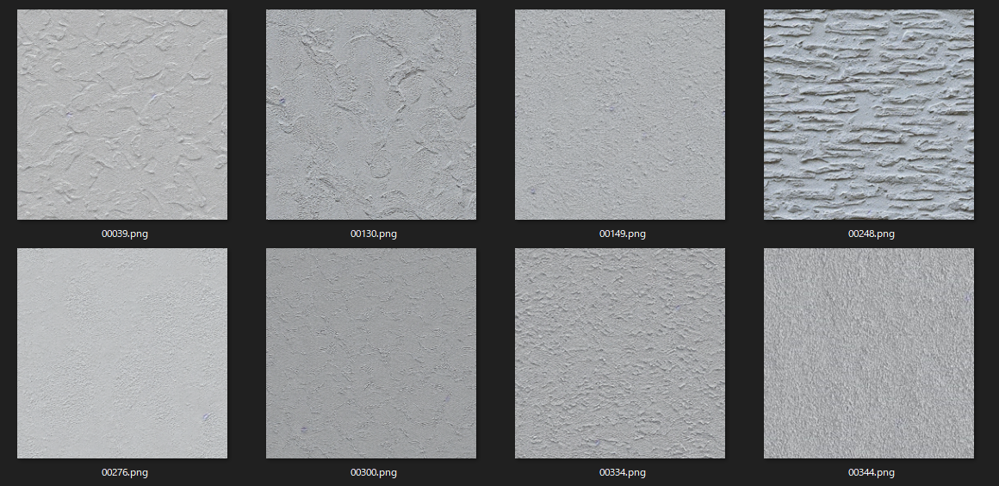
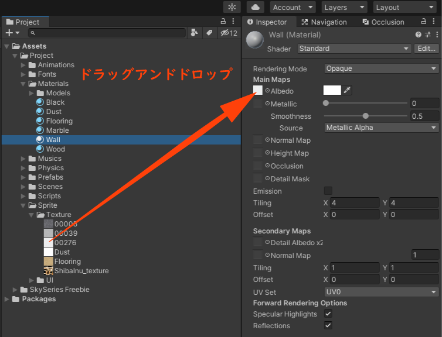
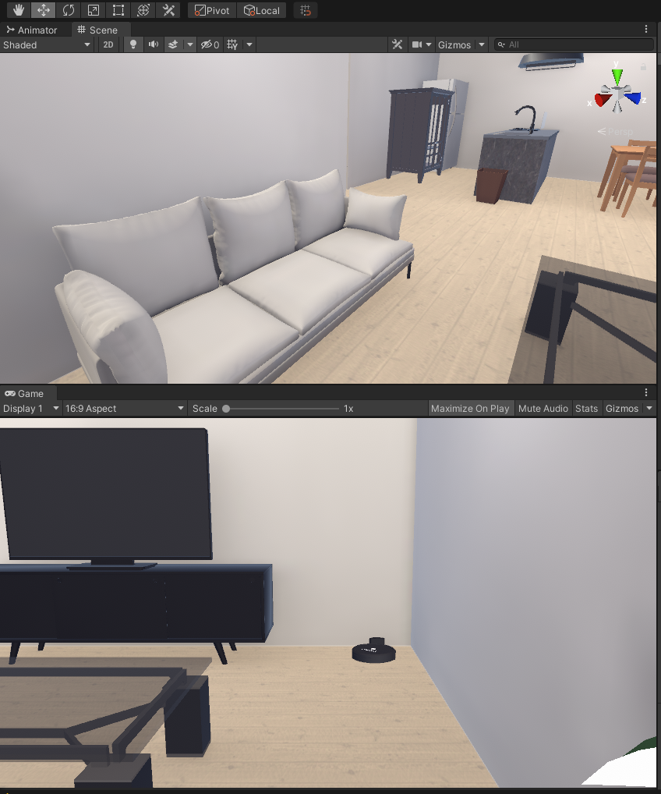
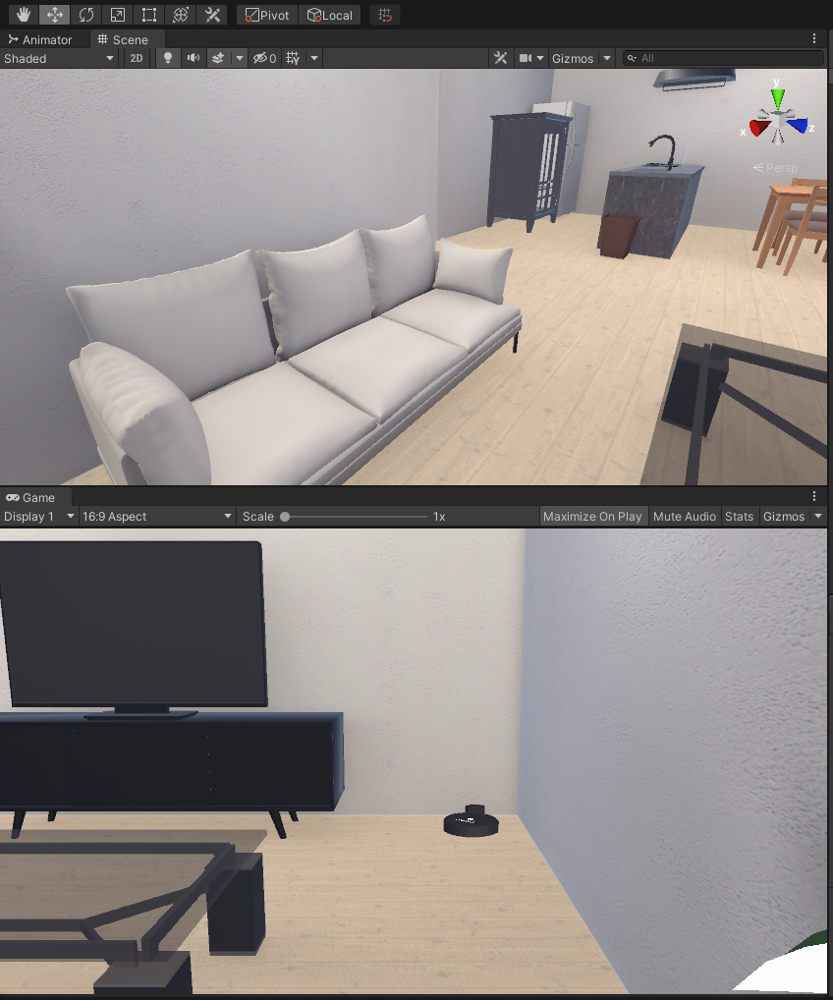

# Stable Diffusionを用いてUnityのゲーム制作用でのテクスチャを生成した話
**Operation R** の情報ページは [**こちら**](../works/OperationR.md) 

## 🔨 環境構築

### ローカルに環境構築
Windowsのローカル環境にStable Diffusionの環境を構築する

[Stable Diffusionをローカルで使おう！〜構築から使い方まで](https://golabo.net/stable_diffusion_make_uses/)

上記の記事を参考にして、環境構築を済ませました。

### シームレステクスチャを生成するために改変

[StableDiffusionでシームレスなテクスチャ・タイリング画像を出力する方法](https://note.com/fururu3d/n/n951dd56da65c)

「(方法2) txt2img.pyを直接実行している場合」の「optimized_txt2img.pyを改変します。17行目付近」を編集します。

---

## 📝 生成したい画像の文章を作る
生成したいテクスチャの文章を作る

### 壁のテクスチャを作りたい

頭の中で思い浮かべている壁のイメージを箇条書きで考えてみます。

- 白い壁(white wall)

次に作りたいテクスチャ

- シームレステクスチャ(seamless texture)

マンションの壁に使われていそうな材質の単語を調べます。化粧しっくい(stucco)と漆喰(plaster)が合いそうな気がします。

- 化粧しっくい(stucco)
- 漆喰(plaster)

以上の単語をつなぎわせて文章を作ります。

```
White paint wall stucco plaster texture seamless
```

これをプロンプトに入力します。

```
--prompt "White paint wall stucco plaster texture seamless"
```

しばらくすると何枚かのテクスチャが生成されます。



このように文章をもとにした画像が出来ました。

---

## ⚖️ 品質の良い画像の選定
生成した画像から品質の良い画像を選定する



このような画像はテクスチャとして不適切なので削除します。



穴があるものや青い点がついているものも削除します。



綺麗なテクスチャが残りました。

---

## ⚙️ 生成したテクスチャをUnityで適用する

壁のマテリアルを選択して、Inspectorの中の、Albedoの横にある白い矩形にドラックアンドドロップします。



### 修正前
真っ白でツルツルだった壁が、



### 修正後
ザラザラした、本物の壁みたいになりました。



完成です。

---

## 関連記事
[Operation R作品詳細](../works/OperationR.md)