# Photoshopのドロップレットを用いて、複数枚の画像を自動で切り取る

## ドロップレット用アクションを作成
### 新規アクションの作成
メニューの[ウィンドウ]→[アクション]をクリックしてアクションパネルを開きます。

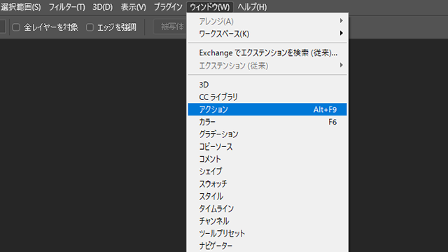

新規アクションの作成をします。

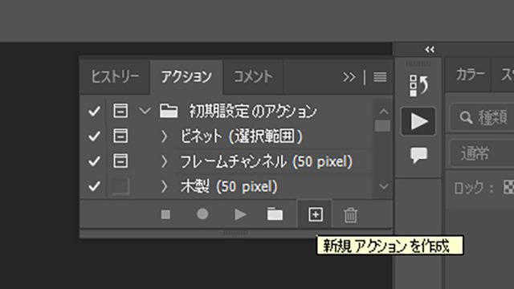

アクション名は「自動切り抜き」にしました。

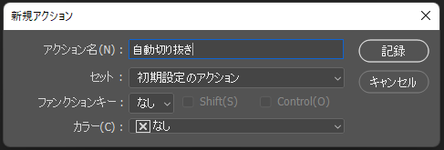

---

### アクションの記録
[記録]ボタンを押して、アクションの記録をしていきます。

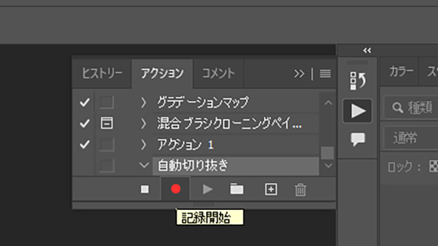

メニューの[ファイル]→[開く]をクリックして、切り取りたい画像を開きます。

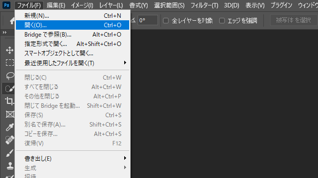

切り抜きツールを使って、画像を切り抜きます

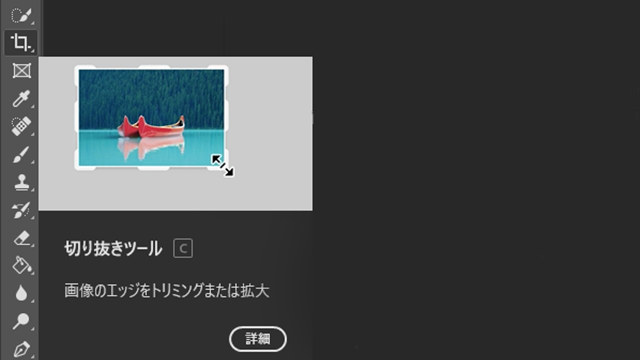

Ctrl+Sで保存をし、ファイルを閉じます

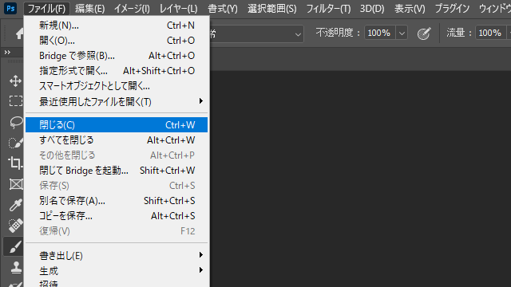

再度、アクションパネルを開きます。
[再生/記録を中止]ボタンをクリックして、アクションの記録を終了します。

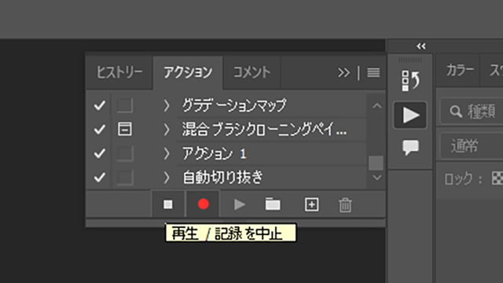

記録したアクションはこんな感じになります。

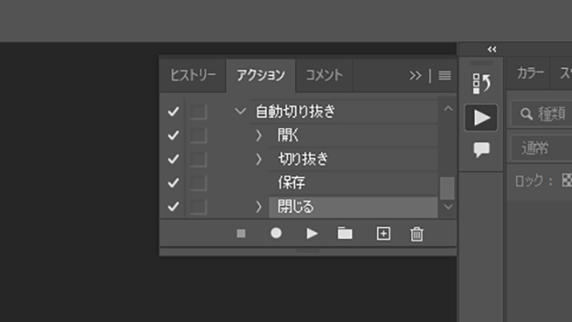

## ドロップレットを作成
メニューの[ファイル]→[自動処理]→[ドロップレットの作成]をクリックして、ドロップレット作成のダイアログボックスを表示します。

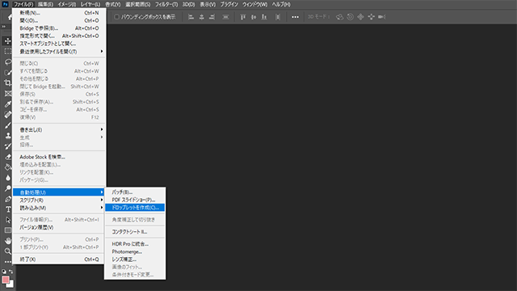

1. ドロップレットの保存先を選択します
1. 実行したいアクションを選択します
1. 「開くコマンドは無視」にチェックを入れます
1. 実行後は「なし」を選択します
1. 「OK」ボタンをクリックします

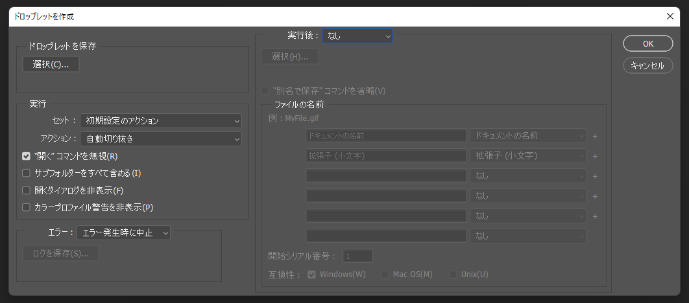

保存先にデスクトップを選択すると、このようにデスクトップにドロップレットが作成されます。

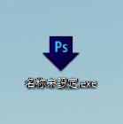

## 実際に使ってみる
切り抜きたい画像を選択して、作成したドロップレットにドラック&ドロップします。

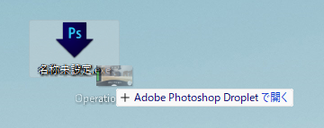

画像が切り取られました。

完成です。