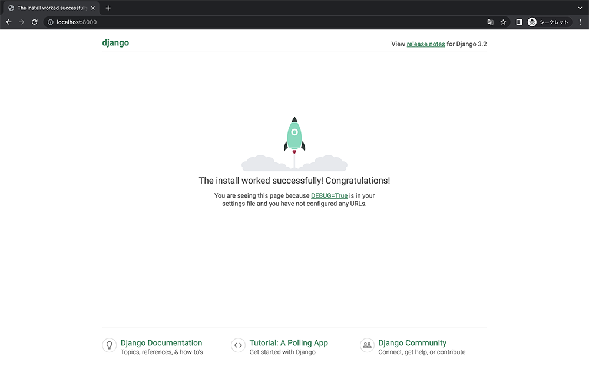

# docker環境でDjangoアプリ開発

## はじめに
[クィックスタート: Compose と Django](https://docs.docker.jp/compose/django.html#compose-django)を参考にして、Django/PostgreSQL アプリの開発環境を構築しました。

## 開発環境
MacBook Air (M2チップ搭載 2022モデル)

## プロジェクトのコンポーネントを定義
### Dockerfile を作成
Dockerfileを作成し、次の内容を加えます。
```
FROM python:3.9-buster
ENV PYTHONUNBUFFERED 1
RUN mkdir /code
WORKDIR /code
ADD requirements.txt /code/
RUN pip install -r requirements.txt
ADD . /code/
```

### requirements.txt を作成
参考サイトでインストールされているDjangoのバージョンは古かったので上げています。
```
Django>=3.0,<4.0
psycopg2
```

### docker-compose.yml を作成
```
version: '3'

services:
  db:
    image: postgres
    ports: 
      - "5432:5432"
    environment:
      - POSTGRES_DB=postgres
      - POSTGRES_USER=postgres
      - POSTGRES_PASSWORD=postgres
  web:
    build: .
    command: python3 manage.py runserver 0.0.0.0:8000
    volumes:
      - .:/code
    ports:
      - "8000:8000"
    depends_on:
      - db
```

## Django プロジェクトの作成
プロジェクトのディレクトリに移動して、次のコマンドを打ちます。
```bash
docker-compose run web django-admin.py startproject {プロジェクト名} .
```

## データベースへの接続設定
`{プロジェクト名}/settings.py` ファイルの `DATABASES = ` の箇所を次のように変更します。
```py
DATABASES = {
    'default': {
        'ENGINE': 'django.db.backends.postgresql',
        'NAME': 'postgres',
        'USER': 'postgres',
        'PASSWORD': 'postgres',
        'HOST': 'db',
        'PORT': 5432,
    }
}
```

`docker-compose up` を実行します。

この状態で http://localhost:8000 にアクセスして、以下の画面が表示されたら成功です。



サービスを停止させたい場合は、`Ctrl-C` を押します。

