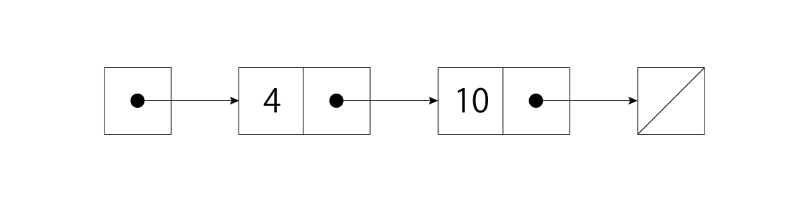
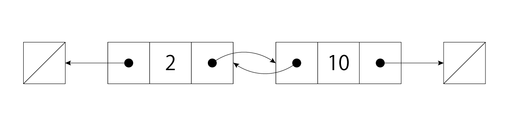

# 連結リスト

## 単方向リスト
単方向リストは、ノードを単方向に繋げたもので、ノードはデータと次のノードを指すリンクを持ちます。



### 実装
言語は C++ です。
```cpp
#include<memory>

template <typename T>
class LinkedList{
private:
    struct Node{
        T data;
        std::shared_ptr<Node> next;
        Node(T data, std::shared_ptr<Node> next = nullptr ) : data(data), next(next) {}
    };
    std::shared_ptr<Node> head = nullptr;
public:
    void append(T data){
        std::shared_ptr<Node> new_node(new Node(data));
        if(head == nullptr){
            head = new_node;
            return;
        }
        std::shared_ptr<Node> last_node = head;
        while (last_node->next != nullptr)
        {
            last_node = last_node->next;
        }
        last_node->next = new_node;
    };
    void insert(T data){
        std::shared_ptr<Node> new_node(new Node(data, head));
        head = new_node;
    }
    void print(){
        std::shared_ptr<Node> current_node = head;
        while (current_node != nullptr)
        {
            std::cout<<current_node->data<<" ";
            current_node = current_node->next;
        }
        std::cout<<"\n";
    }
    void remove(T data){
        if(head == nullptr) return;
        if(head->data == data){
            head = head->next;
            return;
        }
        std::shared_ptr<Node> current_node = head;
        std::shared_ptr<Node> previous_node;
        while(current_node != nullptr && current_node->data != data){
            previous_node = current_node;
            current_node = current_node->next;
        }
        if (current_node == nullptr) return;
        previous_node->next = current_node->next;
    }
    void reverse_iterative(){
        std::shared_ptr<Node> current_node = head;
        std::shared_ptr<Node> previous_node = nullptr;
        while(current_node != nullptr){
            std::shared_ptr<Node> next_node =current_node->next;
            current_node->next = previous_node;
            previous_node = current_node;
            current_node = next_node;
        }
        head = previous_node;
    }
private:
    std::shared_ptr<Node> reverse_recursive(std::shared_ptr<Node> current_node, std::shared_ptr<Node> previous_node){
        if(current_node == nullptr) return std::move(previous_node);
        std::shared_ptr<Node> next_node =current_node->next;
        current_node->next = previous_node;
        previous_node = current_node;
        current_node = next_node;
        return reverse_recursive(current_node, previous_node);
    }
public:
    void reverse_recursive(){
        head = reverse_recursive(head, nullptr);
    }
};
```
### サンプルコード
```cpp
int main(){
    LinkedList<int> list;
    list.append(10);
    list.append(20);
    list.append(30);
    list.insert(0);
    list.print();
    list.reverse_iterative();
    list.print();
    list.reverse_recursive();
    list.print();
}
```
### 結果
```
0 10 20 30
30 20 10 0
0 10 20 30
```

---

## 双方向リスト
各ノードはデータと 2 つのリンクを持っています。リンクはそのノードの次のノードを後ろのノードを指しています。



### 実装
```cpp
#include<memory>

template <typename T>
class DoublyLinkedList{
private:
    struct Node{
        T data;
        std::shared_ptr<Node> next;
        std::shared_ptr<Node> prev;
        Node(T data, std::shared_ptr<Node> next = nullptr, std::shared_ptr<Node> prev = nullptr) : data(data), next(next) , prev(prev) {}
    };
    std::shared_ptr<Node> head = nullptr;
public:
    void append(T data){
        std::shared_ptr<Node> new_node(new Node(data));
        if(head == nullptr){
            head = new_node;
            return;
        }
        std::shared_ptr<Node> current_node = head;
        while (current_node->next != nullptr)
        {
            current_node = current_node->next;
        }
        current_node->next = new_node;
        new_node->prev = current_node;
    };
    void insert(T data){
        std::shared_ptr<Node> new_node(new Node(data, head));
        if(head == nullptr){
            head = new_node;
            return;
        }
        head->prev = new_node;
        new_node->next = head;
        head = new_node;
    }
    void print(){
        std::shared_ptr<Node> current_node = head;
        while (current_node != nullptr)
        {
            std::cout<<current_node->data<<" ";
            current_node = current_node->next;
        }
        std::cout<<"\n";
    }
    void remove(T data){
        if(head == nullptr) return;
        if(head->data == data){
            if(head->next == nullptr){
                head = nullptr;
                return;
            }
            std::shared_ptr<Node> next_node = head.next;
            next_node->prev = nullptr;
            head = next_node;
            return;
        }
        std::shared_ptr<Node> current_node = head;
        while(current_node != nullptr && current_node->data != data){
            current_node = current_node->next;
        }
        if (current_node == nullptr) return;
        if(current_node->next == nullptr){
            current_node->prev->next = nullptr;
            return;
        }
        std::shared_ptr<Node> next_node = current_node->next;
        std::shared_ptr<Node> prev_node = current_node->prev;
        prev_node->next = next_node;
        next_node->prev = prev_node;
        return;
    }
    void reverse_iterative(){
        std::shared_ptr<Node> current_node = head;
        std::shared_ptr<Node> previous_node = nullptr;
        while(current_node != nullptr){
            previous_node = current_node->prev;
            current_node->prev = current_node->next;
            current_node->next = previous_node;
            current_node = current_node->prev;
        }
        if(previous_node != nullptr) head = previous_node->prev;
    }
private:
    std::shared_ptr<Node> reverse_recursive(std::shared_ptr<Node> current_node){
        if(current_node == nullptr) return nullptr;
        std::shared_ptr<Node> previous_node = current_node->prev;
        current_node->prev = current_node->next;
        current_node->next = previous_node;

        if(current_node->prev == nullptr) return  std::move(current_node);
        return reverse_recursive(current_node->prev);
    }
public:
    void reverse_recursive(){
        head = reverse_recursive(head);
    }
};
```
### サンプルコード
単方向リストと使い方は変わりません。
```cpp
int main(){
    DoublyLinkedList<int> list;
    list.append(10);
    list.append(20);
    list.append(30);
    list.insert(0);
    list.print();
    list.reverse_iterative();
    list.print();
    list.reverse_recursive();
    list.print();
}
```
### 結果
```
0 10 20 30
30 20 10 0
0 10 20 30
```