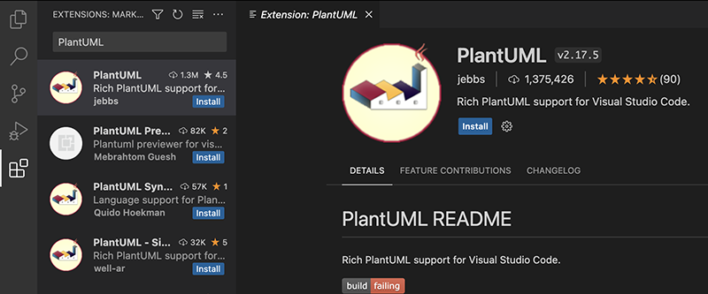
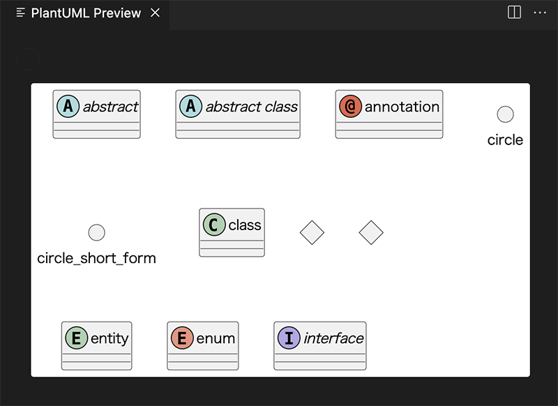
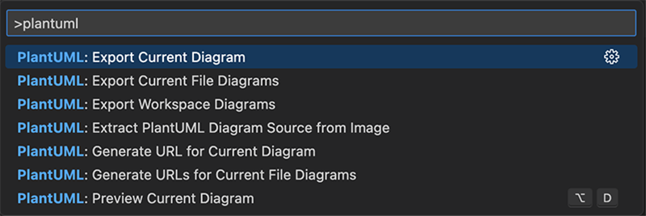
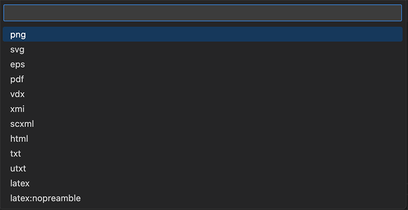

# VS Code で PlantUML を使う
### 目次
[[toc]]

## はじめに
M2 MacBook Air で PlantUML の環境構築をした際の手順をまとめました。

## Homebrew をインストール
Homebrew を使ってインストールをしていくため、入っていない場合は下記の記事を参考にしてインストールしてください。

[M2 Mac に Homebrew をインストール](https://zenn.dev/watakarinto/articles/16451707aa08d1)

## Java をインストール
```bash
brew install --cask adoptopenjdk
```

## Graphviz をインストール
```bsdh
$ brew install graphvizs
```

## PlantUML をインストール
```bash
brew install plantuml
```

## VS Code のプラグインをインストール
VS Codeが入っていない場合はインストールします。
```bash
brew install visual-studio-code
```

VS Code 上で PlantUML のプラグインをインストールします。



## 使ってみる
ファイルの拡張子は`wsd, pu, puml, plantuml, iuml`に対応しています。

```
@startuml
abstract        abstract
abstract class  "abstract class"
annotation      annotation
circle          circle
()              circle_short_form
class           class
diamond         diamond
<>              diamond_short_form
entity          entity
enum            enum
interface       interface
@enduml
```

`Option + d`を押すとプレビューを表示できます。



## 画像で保存する
`command + shift + p`でコマンドパレットを表示し、`plantuml`と入力します。

`PlantUML: Export current diagram`を選択しましょう。



保存するファイル形式を選択します。



## リンク
[公式ドキュメント](https://plantuml.com/ja/)

