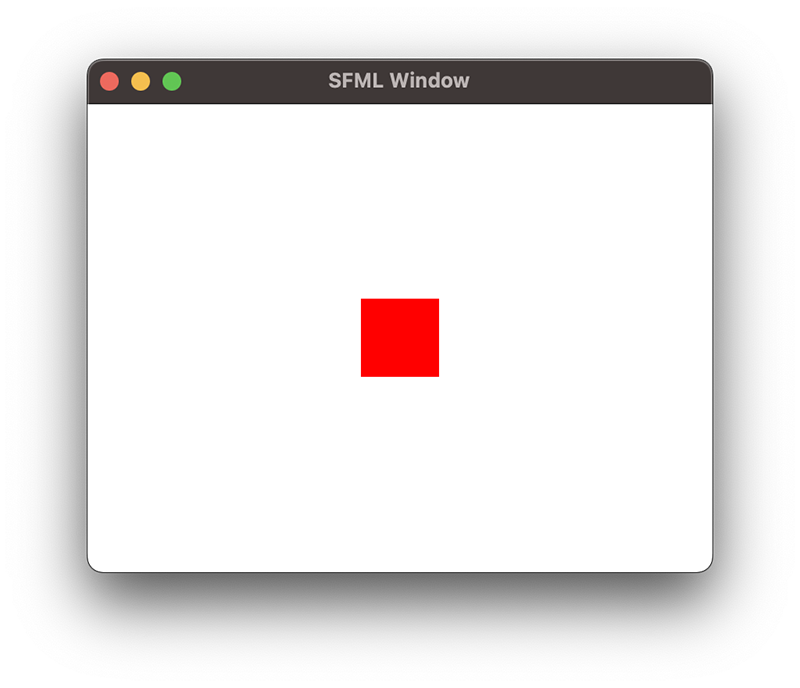

# C++ で SFML を使って描画を行う

## はじめに
この記事は M2 MacBook Air で SFML を使って描画を行った手順についてまとめています。SFML は、グラフィックス、オーディオ、ネットワーク、ウィンドウ、およびシステムの5つのモジュールから構成されているクロスプラットフォームな C++ ライブラリです。

## SFML をインストール
Homebrew で、SFML をインストールします。
```bash
brew install sfml
```

Linux では、ディストリビューションのパッケージマネージャーを使ってインストールします。
Debian ベースのディストリビューションでは、次のコマンドを実行します。
```bash
sudo apt install libsfml-dev
```

## プロジェクトの作成
次に、SFMLを使用して簡単な描画を行う C++ プログラムを作成します。ウィンドウを作成し、真ん中に赤い四角形を表示させてみます。
```cpp
#include <SFML/Graphics.hpp>

int main()
{
    // ウィンドウの作成
    sf::RenderWindow window(sf::VideoMode(800, 600), "SFML Window");

    // 四角形の作成
    sf::RectangleShape rectangle(sf::Vector2f(100.f, 100.f));
    rectangle.setFillColor(sf::Color::Red);
    rectangle.setPosition(350.f, 250.f);

    // ゲームループ
    while (window.isOpen())
    {
        // イベントの処理
        sf::Event event;
        while (window.pollEvent(event))
        {
            if (event.type == sf::Event::Closed)
            {
                window.close();
            }
        }

        window.clear(sf::Color::White);
        window.draw(rectangle);
        window.display();
    }
}
```

## ビルド
CMakeLists.txtファイルを使用して、プログラムをビルドします。
```cmake
cmake_minimum_required(VERSION 3.0)
project(SFMLTest)
find_package(SFML 2.5 COMPONENTS graphics REQUIRED)
add_executable(SFMLTest main.cpp)
target_link_libraries(SFMLTest sfml-graphics)
```
プログラムをビルドするために、以下のコマンドを使用します
```bash
mkdir build
cd build
cmake ..
make
```

## コンパイル
clang++ を使用して、プログラムをコンパイルする場合は、次のようにします。
```bash
clang++ -o SFMLTest main.cpp -I/opt/homebrew/include -L/opt/homebrew/Cellar/sfml/2.5.1_2/lib -lsfml-graphics -lsfml-window -lsfml-system
```

## 実行
```bash
./SFMLTest
```
次のようなウィンドウが表示されます。
真ん中に赤い四角形が表示されていることが確認できます。

