# VS Code で C++ のビルド環境を整える
### 目次
[[toc]]


## はじめに
この記事では、VS Code 上で CMake のビルドを行うための環境構築とビルド手順について説明します。 

## CMake の環境構築
### CMake をインストールする
#### Windows の場合
[CMake公式サイト](https://cmake.org/download/)にアクセスして

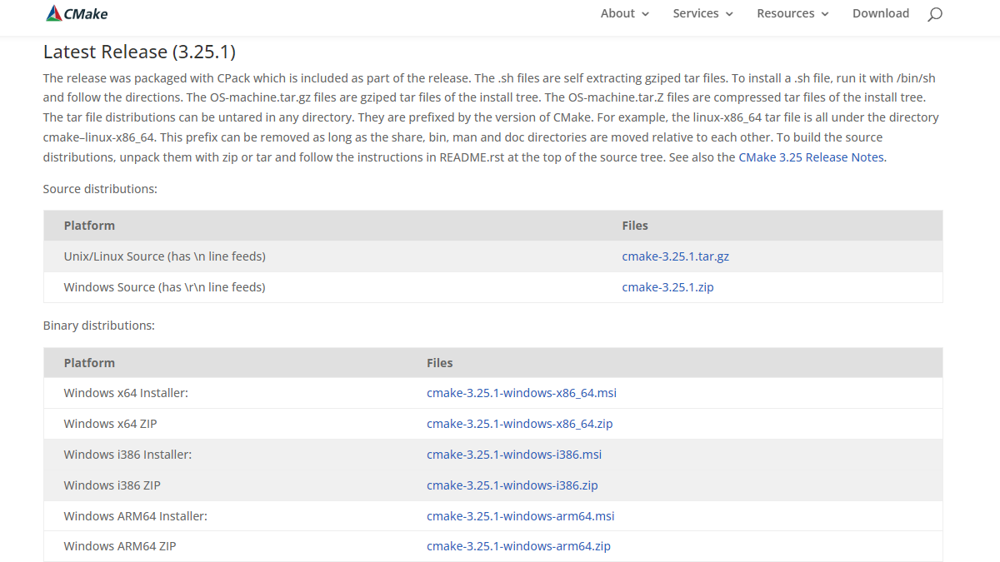

最新のWindows版バイナリ（.msi） をダウンロードします。

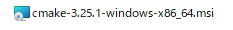

次に、ダウンロードした .msi ファイルを実行して CMake をインストールしていきます。

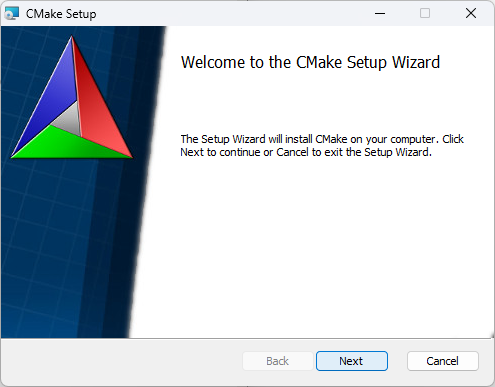

ライセンス条項を読んだら、「I accept the terms in the License Agreement」をチェックします。

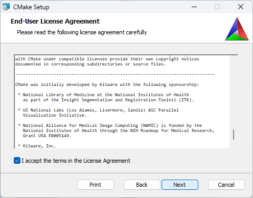

「Add CMake to the system PATH for all users」をチェックします。

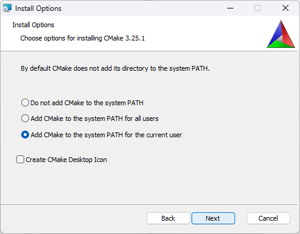

インストールディレクトリは既定のままにしました。

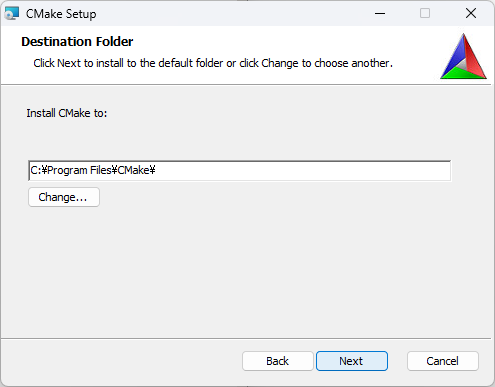

インストールしていきます。

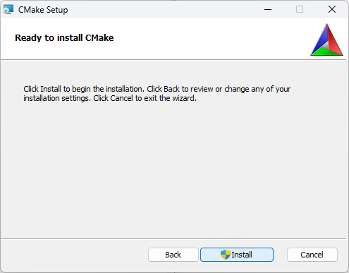
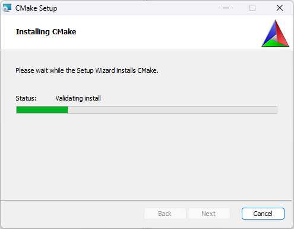

インストールが完了したら、「Finish」を選択して閉じます。

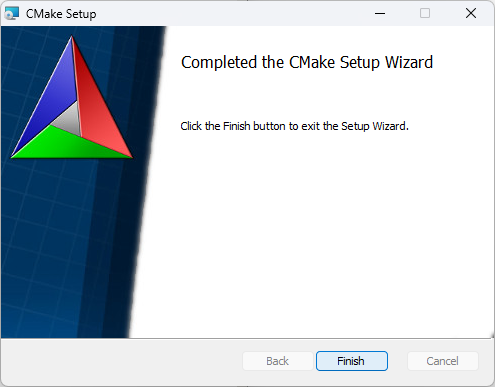

#### Mac の場合
homebrew を使ってインストールできます。

`$ brew install cmake`

### VS Code に CMake Tools をインストール
[CMake Tools](https://marketplace.visualstudio.com/items?itemName=ms-vscode.cmake-tools) をインストールします。

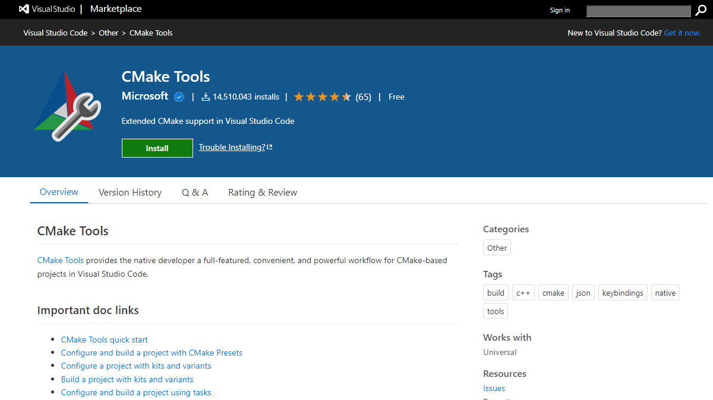

Install をクリックすると VS Code にとびます。

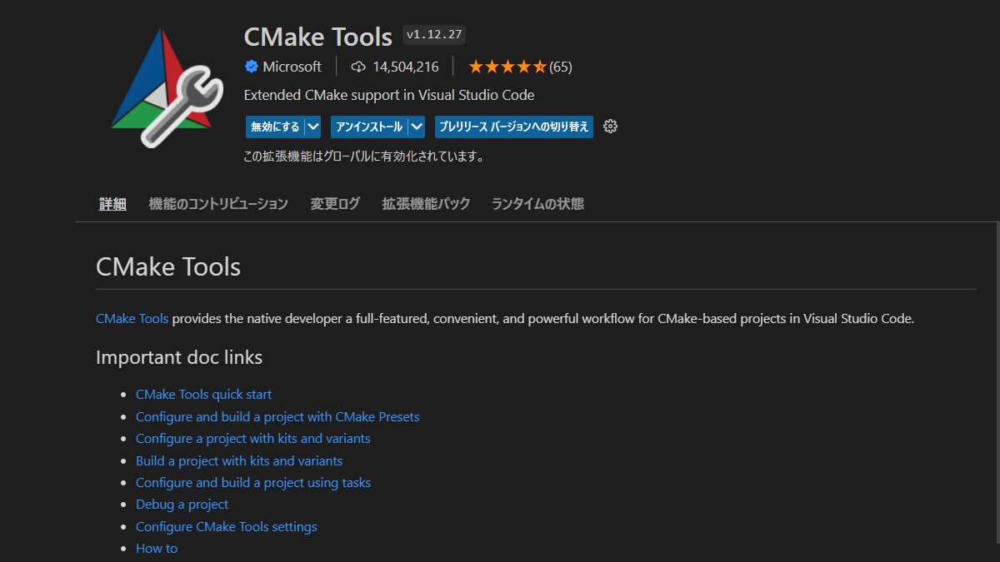

このような表示になっていたら OK です。

## Windows のみ行うこと
### Ninjaをダウンロードする
Ninja の [GitHub](https://github.com/ninja-build/ninja/releases) にアクセスして

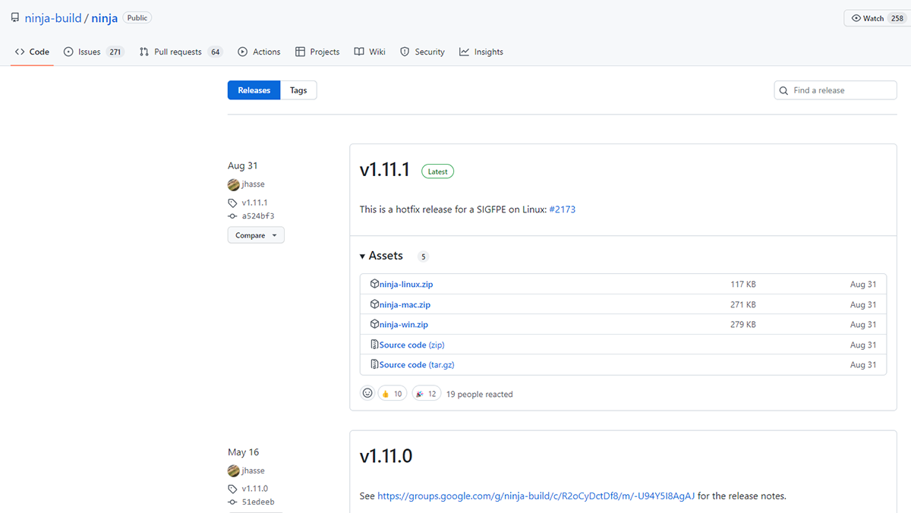

ninja-win.zip をダウンロードします。

### ninja.exe のパスを通す

検索ボックスで「システム環境変数の編集」を検索して、開きます。

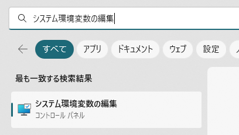

環境変数を選択します。

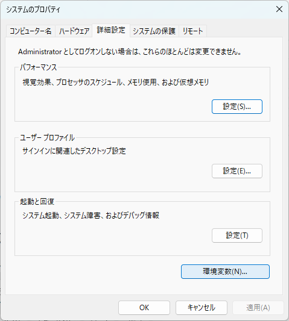

システム環境変数のPathを選択して、編集をクリックして

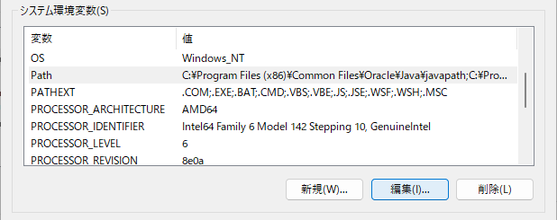

「新規」を選択します。

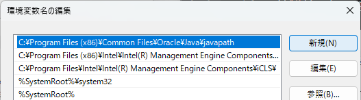

ここにninja.exeファイルのあるアドレスを入力します。

## VS Code での操作
今回使用するテストコードは [GitHub](https://github.com/guinpen98/CMake_Test) においてあります。

ディレクトリ構成はこんな感じです
```
CMake_Test/
         ├ test.h
         ├ test_main.cpp
         └ CMakeLists.txt
```
CMakeLists.txtはこのようにシンプルな内容になっています。
```cmake
cmake_minimum_required(VERSION 3.1)
project(cmake_test CXX)
add_executable(cmake_test test_main.cpp)
```
### キットの選択
VS Code のステータスバー（画面の下の青いバー）からキットの選択をしていきます。


「No Kit Selected」をクリックして

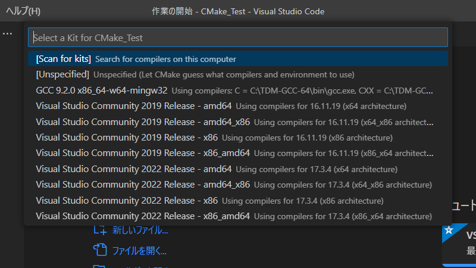

自分の使用しているコンパイラを選択します。

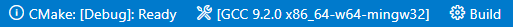

このように自分の選択したキットが表示されたら完了です。

### プロジェクトの構成
VS Code のアクティビティーバーから CMake を選択して

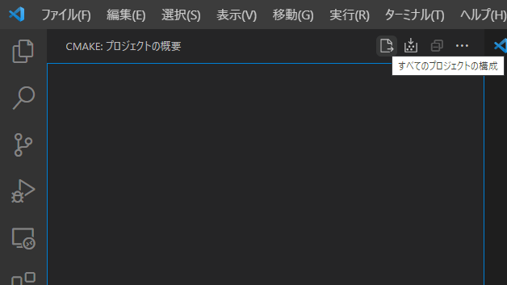

すべてのプロジェクトの構成をクリックします。

### ビルド
すべてのプロジェクトをビルドをクリックすると一括でビルドできますが

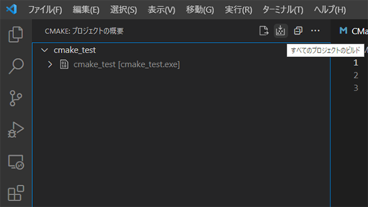

各ターゲットに照準を合わせると、別々にビルドすることも可能です。

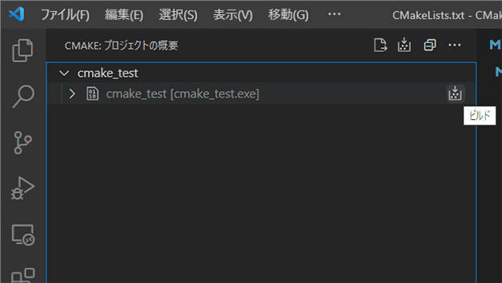

### デバッグ
ターゲットを右クリックして、デバッグを選択します。

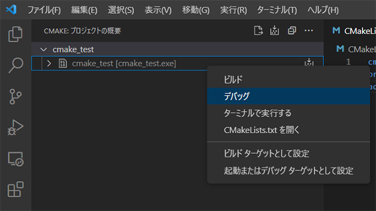

無事にデバッグできました。

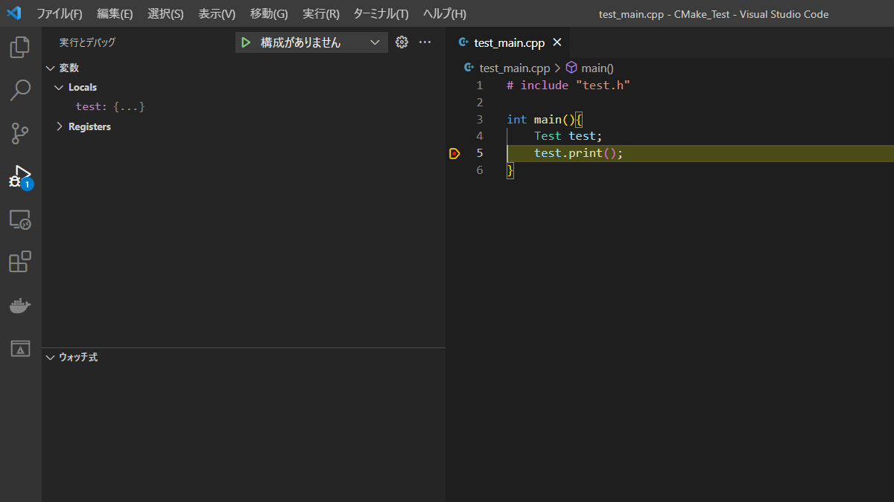