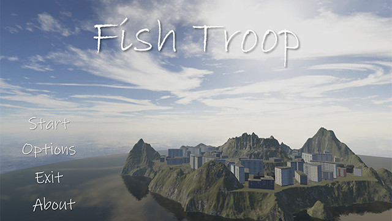

# Fish Troop
---

### 目次
[[toc]]

## リンク
- [Speaker Deck](https://speakerdeck.com/guinpen98/fish-troop)

## 概要
|ジャンル|制作人数|制作期間|開発環境|
|:---:|:---:|:---:|:---:|
|3Dシューティングゲーム|5人|2023年4月〜2023年7月|Unity|

<iframe width="640" height="360" src="https://www.youtube.com/embed/YjhAAt8Ro10" title="FishTroop" frameborder="0" allow="accelerometer; autoplay; clipboard-write; encrypted-media; gyroscope; picture-in-picture; web-share" allowfullscreen></iframe>

## 作品解説
ドローンたちが暮らしている Troop 島に、プレイヤーが襲撃します。ドローンたちは、群れになってプレイヤーを攻撃してきます。プレイヤーは、ドローンたちの攻撃を避けながら、敵のコアを破壊します。

## 工夫した点
- 魚群を表現するために、Boid アルゴリズムを改善したアルゴリズムを編み出した

## 苦労した点
- 個体の一つが死体のように群れを形成してしまう問題を解決があり、活き活きとした群れを表現することに苦労した
- ドローンの数を増やすと、計算量が増えてしまい、処理が重くなってしまう問題を解決するために、モートンコードや、オクトツリーを用いて、計算量を減らすことに苦労した
