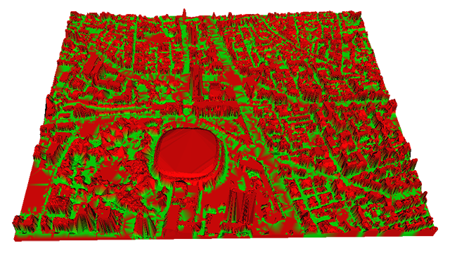

# ImageContents1

---
### 目次
[[toc]]

## リンク
- [GitHub](https://github.com/HotariTobu/ImageContents1/tree/develop)

## 概要
|ジャンル|制作人数|制作期間|開発環境|
|:---:|:---:|:---:|:---:|
|3DCG|5人|2022年9月～|C++|

## 制作目的
学校の授業で制作

## 制作チーム
||役割|担当|
|---|---|---|
|HorariTobu|リーダー, プログラマ|作業全般|
|私|PM, プログラマ|資料作成, 関数の設計, バグ対応|
|yu-getu|プログラマ|一部関数の実装, パラメータ調整|
|D0000000000N|プログラマ|一部関数の実装, パラメータ調整|
|baconcateegg|プログラマ|一部関数の実装, パラメータ調整|

## 使用したアルゴリズム
- ドロネーの三角形分割
- flood fill

## 開発ツール
- CMake

## 工夫点
- データ処理の際に、4近傍や8近傍などさまざまな手法で処理を行えるようにした

## 苦労したこと・改善点
- プロジェクトマネジメント
- 空間計算量の改善

## 今後の展望
- パラメータの調整
- 処理の最適化