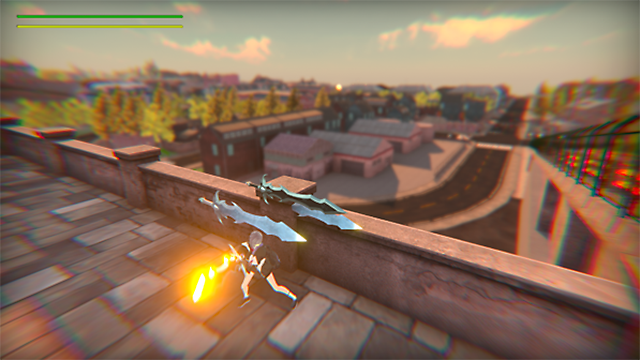

# ImagiGate

---
### 目次
[[toc]]

## 概要
|ジャンル|制作人数|制作期間|開発環境|
|:---:|:---:|:---:|:---:|
|探索型アクションゲーム|4人|3ヶ月|Unity|

## 制作目的
ゲーム制作に慣れるために制作

## 制作チーム
学校のサークルメンバー4人
||役割|担当|
|---|---|---|
|🐧 私|プログラマ|敵AI|
|🗡️ メンバー1|プログラマ|ソースコード全般|
|⛰️ メンバー2|デザイナー|地形・街並みの作成|
|🌿 メンバー3|デザイナー|ロゴデザイン, UIデザイン(クエストクリア画面)|

# 👷‍♂️ 工事中