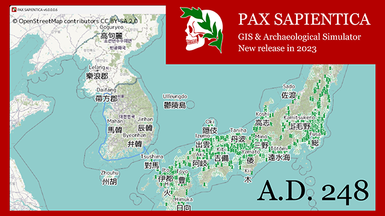

# PAX SAPIENTICA
---

目次
[[toc]]

## リンク
- [GitHub](https://github.com/AsPJT/PAX_SAPIENTICA)

## 概要
|ジャンル|制作人数|制作期間|開発環境|
|:---:|:---:|:---:|:---:|
|歴史シミュレーション|2人|2023年2月〜|C++|

## 制作チーム
||役割|担当|
|---|---|---|
|🐧私|プログラマ|シミュレーション|
|🌍AsPJT|企画, デザイナー, プログラマ|データ管理|

## 使用ライブラリ
- Siv3D
